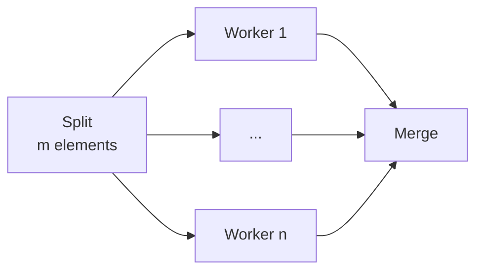
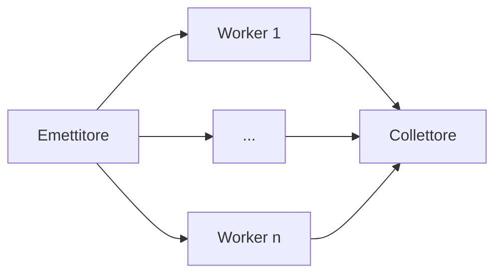

# Parallelismo standard

Numero elementi per worker: $m\over{n}$

$T_{split}^n$ = Tempo impiegato per dividere gli elemeti (dipende da n)

$T_{w}$ = Tempo unitario del singolo worker

$T_{merge}^n$ = Tempo impiegato per unire l'operato dei worker (dipende da n)

## Tempo di completamento con grado di parallelismo n

$$T_c^n = T_{split}^n + T_{w}\cdot {m\over{n}} + T_{merge}^n$$

## Scalabilità con grado di parallelismo n

Scalabilità = Aumento velocità rispetto al caso sequenziale

$$S^n = {T_c^1\over{T_c^n}}={m\cdot T\over T_{split} + T\cdot {m\over{n}} + T_{merge}}$$

### Caso ottimo:

$$T_{split} = 0\land T_{merge} = 0 \Rightarrow {m\cdot T\over T\cdot {m\over{n}}} = n$$

## Efficienza relativa con grado di parallelismo n

Indica la distanza tra le prestazioni ottenute e quelle ideali.

$$\epsilon^n={T_c^1\over n}\cdot{1\over{T_c^n}} = {S^n\over n}$$

# Parallelismo spaziale

$T_a$ = Tempo di interarrivo (Tempo medio che passa dall'arrivo di un elemento ad un altro)

$T = T_w^1$

$T_p$ = Tempo di interpartenza

$$T_a > 0 \land T_a \leq T\Rightarrow T_p = T$$

$$T_a > 0 \land T_a > T\Rightarrow T_p = T_a$$

$$T_e = 1, T_w = 4, T_c=1$$

```mermaid
gantt
    dateFormat  s
    axisFormat  ''

    section E
    1 : 1,1s
    2 : 2,1s
    3 : 3,1s
    4 : 4,1s
    5 : 5,1s
    section W1
    1: 2,4s
    5:6,4s
    section W2
    2: 3,4s
    section W3
    3: 4,4s
    section W4
    4: 5,4s
    section C
    1 : 6,1s
    2 : 7,1s
    3 : 8,1s
    4 : 9,1s
    5 : 10,1s
```

$$T_p = max\left\lbrace T_e, T_c, {T\over n}, T_a\right\rbrace$$

# Parallelismo temporale

Mettiamo caso che un solo lavoratore esegua 3 compiti

```mermaid
gantt
    dateFormat  s
    axisFormat  ''

    section Ta
    1 : 1,1s
    2 : 2,1s
    3 : 3,1s
    section W1
    1:milestone,2,2
    Work 1: 2,1s
    Work 2: 3,1s
    Work 3 : 4,1s
    1:milestone,8,2
    2:milestone,8,2
    Work 1: 5,1s
    Work 2: 6,1s
    Work 3 : 7,1s
    2:milestone,14,2
    3:milestone,14,2
    Work 1: 8,1s
    Work 2: 9,1s
    Work 3 : 10,1s
    3:milestone,20,2
    section Tp
    1 : 5,1s
    2 : 8,1s
    3 : 11,1s
```

$$T_p = 3T = T_w^1$$

$$T_c^1 = 3T\cdot m$$

$$T_a > 0 => T_p = max\left\lbrace T_a, T_w\right\rbrace$$

$$T_c = m\cdot T_p$$

Possiamo spezzettare il suo lavoro ed assegnarne una parte ad altri lavoratori

```mermaid
gantt
    dateFormat  s
    axisFormat  ''

    section Ta
    1 : 1,1s
    2 : 2,1s
    3 : 3,1s
    section W1
    1 : 2,1s
    2 : 3,1s
    3 : 4,1s
    section W2
    1 : 3,1s
    2 : 4,1s
    3 : 5,1s
    section W3
    1 : 4,1s
    2 : 5,1s
    3 : 6,1s
    section Tp
    1 : 5,1s
    2 : 6,1s
    3 : 7,1s
```

La latenza è il tempo da quando un input entra nel circuito a quando esce il corrispettivo output:

$$L=3T+\Delta$$

Questa non migliora anzi la $\Delta$ (rappresentante il tempo di passaggio dell'oggetto da un worker all'altro) lo
peggiora.

Tuttavia migliora il Throughput, ossia il numero di oggetti processabili per unità di tempo poiché quando il worker 1 ha
finito la sua parte comincia subito col rifarlo con un nuovo oggetto, mentre il worker 2 continua con il primo.

$$T_s^3=T$$

$$T_c^3=m\cdot T+(n-1)\cdot T \approx m\cdot T$$

Non è quasi mai vero che gli stadi anno la stessa durata quindi:

$$T_s = max\left\lbrace T_s\text{(stadio 1)}, ... ,T_s\text{(stadio n)}\right\rbrace$$
