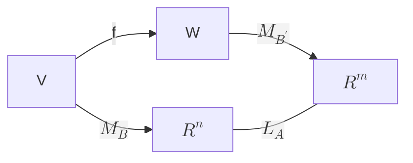

# Matrice associata

Siano:

-   $V,W$ spazi vettoriali su $\mathbb{R}$;
-   $v_1,\dots,v_n$ vettori di $V$ che formano una base $B$;
-   $w_1,\dots,w_n$ vettori di $W$ che formano una base $B'$;
-   $f:V\rightarrow W$ un'applicazione lineare.

Otteniamo isomorfismi:

$$M_B:V\rightarrow\mathbb{R}^n,M_{B'}:W\rightarrow\mathbb{R}^m$$

$A$ è la matrice associata a $f$ rispetto alle basi $B, B'$; scriviamo:

$$M^B_{B'}(f)=A$$

Equivalentemente:

La matrice associata a $f$ è l’unica matrice $M^B_{B'}$ che soddisfa:

$$M^B_{B'}(f)M_B(v)=M_{B'}(f(v))$$

## Casi notevoli

$$
V=\mathbb{R}^n, W=\mathbb{R}^m\land B,B'=\text{basi canoniche}\Rightarrow\\
M^B_{B'}(f)\text{ soddisfa }Av=f(v), cioé\ f=L_A
$$

$$
W=\mathbb{R}^m\land C=\text{base canonica}\Rightarrow\\
M^B_C(f)=(f(v_1),\dots,f(v_n))
$$

In generale, la colonna j-esima di $M^B_{B'}(f)$ è il vettore (colonna) delle coordinate di $f(v_j)$ rispetto a $B'$.

$$
B,B'\text{ basi di }V\Rightarrow M_{B'}(v)=M^B_{B'}(Id)M_B(v)
$$

La matrice $M^B_{B'}(Id)$ è la matrice del cambiamento di base da $B$ a $B'$

Siano:

$$
\begin{pmatrix}
  x_1\\
  \vdots\\
  x_n
\end{pmatrix}=\text{coordinate di v rispetto a B}
$$

$$
\begin{pmatrix}
  y_1\\
  \vdots\\
  y_n
\end{pmatrix}=\text{coordinate di v rispetto a B'}
$$

allora:

$$
\begin{pmatrix}
  y_1\\
  \vdots\\
  y_n
\end{pmatrix}=M^B_{B'}(Id)\begin{pmatrix}
  x_1\\
  \vdots\\
  x_n
\end{pmatrix}
$$

$$
B\land B'\ coincidono\Leftrightarrow M^B_{B'}(Id)=I
$$

# Rango

Il rango (per colonne) di una matrice $A\in M_{m,n}(\mathbb{R})$ è $rank\ A = dim\ Im\ A$.

Il rango per righe di una matrice $A\in M_{m,n}(\mathbb{R})$ è la dimensione di
$Span\lbrace A_1,\dots,A_m\rbrace\subseteq M_{1,n}(\mathbb{R})=\mathbb{R}^n$

Il rango per righe di $A$ è il rango per colonne di $A^t$.

Data una matrice $A\in M_{m,n}(\mathbb{R})$:

$$rank\ A=rank\ A^t$$

(Il rango per righe è uguale al rango per colonne)

## Teorema di Rouchè-Capelli

Sia $A\in M_{m,n}(\mathbb{R}),B\in\mathbb{R}^n$:

$$Ax=b\Leftrightarrow rank(A) = rank(A|B)$$

# Prodotto di matrici

Data un'applicazione lineare $L_A:\mathbb{R}^n\rightarrow\mathbb{R}^m,\exists$ un'unica matrice
$A\in M_{m,n}(\mathbb{R})|L_A(X)=AX$

Data una matrice $m\times n$:

$$A=(a_{ij})$$

e una matrice $n\times k$:

$$B=(b_{ij})$$

possiamo considerare la composizione:

$$\mathbb{R}^k\overset{L_B}{\rightarrow}\mathbb{R}^n\overset{L_A}{\rightarrow}\mathbb{R}^m,\quad X\rightarrow L_A(L_B(X))=A(B(X))$$

---

$$L_A\circ L_B=L_C\Rightarrow C^i=L_A(L_B(e_i))=AB^i$$

---

Data una matrice $m\times n$:

$$A=(a_{ij})$$

e una matrice $n\times k$:

$$B=(b_{ij})$$

definiamo il prodotto $AB$ come la matrice $m\times k$:

$$AB=(AB^1,\dots,AB^k).$$

La j-esima colonna di $AB$ è:

$$
A\begin{pmatrix}
  b_{1j}\\
  \vdots\\
  b_{nj}
\end{pmatrix}=b_{1j}A^1+\cdots+b_{nj}A^n=\begin{pmatrix}
  b_{1j}a_{11}+\cdots+b_{nj}a_{1n}\\
  \vdots\\
  b_{1j}a_{m1}+\cdots+b_{nj}a_{mn}
\end{pmatrix}
$$

## Proprietà del prodotto di matrici

$$AB=(c_{ij})\Rightarrow c_{ij}=\sum_{h=1}^na_{ih}b_{hj}=A_iB_j$$

-   la i-esima riga di $AB$ è:

$$(AB)_i=A_iB;$$

-   la j-esima colonna di AB è:

$$(AB)^j=AB^j$$

Date due matrici $A\land B$:

$$A=m\times n\land B = n\times k\Rightarrow\text{il prodotto è ben definito}$$

$$A=m\times n\land B = m\times n\Rightarrow\text{la somma è ben definita}$$

## Proposizione

Siano $A=(a_ij), B=(b_ij), C=(c_ij)$ tre matrici e $\lambda$ uno scalare:

$$AB,AC,B+C\text{ ben definiti}\Rightarrow A(B+C)=AB+AC$$

$$AC,BC,A+B\text{ ben definiti}\Rightarrow (A+B)C=AC+BC$$

$$AC\text{ ben definiti}\Rightarrow A(\lambda C)=\lambda (AC)$$

$$AB,BC\text{ ben definiti}\Rightarrow A(BC)=(AB)C$$

# Matrice identica e inversa

La matrice identità $I\in M_{n,n}(\mathbb{R})$ è la matrice:

$$
I = (e_1 \cdots e_n) = \begin{pmatrix}
1 & \cdots &  &  &  \\
\vdots & 1 &  &  &  \\
 &  & \ddots &  &  \\
 &  &  & 1 & \cdots \\
 &  &  &  & \ddots \\
 &  &  &  &  & 1
\end{pmatrix}
$$

assocoiata all'applicazione identica $\mathbb{R}^n\rightarrow\mathbb{R}^n,\quad v\rightarrow v$.

In particolare:

$$AI=A=IA$$

Data $A\in M_{n,n}(\mathbb{R})$:

-   $\exists B\in M_{n,n}(\mathbb{R})|AB=I=BA\Rightarrow A\text{ invertibile}$
-   B è inversa di A, $B=A^{-1}$

Allora:

$$A\text{ è invertibile}\Leftrightarrow L_A:\mathbb{R}^n\rightarrow\mathbb{R}^n\text{ è invertibile}$$

$$B\text{ è l'inversa di }A\Rightarrow L_B\text{ è l'inversa di }L_A$$

## Caratterizzazione delle matrici invertibili

Sia $A$ una matrice $n\times n$. Sono equivalenti:

-   $A$ è invertibile;
-   $L_A$ è invertibile;
-   $L_A$ è iniettiva;
-   $L_A$ è suriettiva;
-   le righe di $A$ sono linearmente indipendenti;
-   le colonne di $A$ sono linearmente indipendenti $(Rank\ A = n)$;
-   ogni matrice ottenuta da $A$ applicando l'eliminazione di Gauss ha n pivot;
-   il sistema $AX=0$ ha solo la soluzione banale;
-   il sistema $AX=B$ ha un'unica soluzione $\forall\ B$.

L'inversa di A è la matrice B ottenuta trasformando con operazioni elementari:

$$(A|I)\rightarrow(I|B)$$

## Inversa matrici 2x2

Se:

$$
A=\begin{pmatrix}
  a & b\\
  c & d
\end{pmatrix}
$$

allora:

$$
A^{-1}=\frac{1}{ad-bc}\begin{pmatrix}
  d & -b\\
  -c & a
\end{pmatrix}
$$

# Composizioni e matrici associate

Siano $V,W,U$ tre spazi vettoriali, e siano $B,B',B''$ rispettivamente basi di $V,W,U$.

Siano:

$$f:V\rightarrow W,\quad g:W\rightarrow U$$

applicazioni lineari. Allora:

$$M^{B'}_{B''}(g)M^{B}_{B''}(f)=M^{B}_{B''}(g\circ f)$$

Siano $B\land B'$ due basi di $V\Rightarrow$ le matrice del cambiamento da una base all'altra sono una l'inversa
dell'altra.
