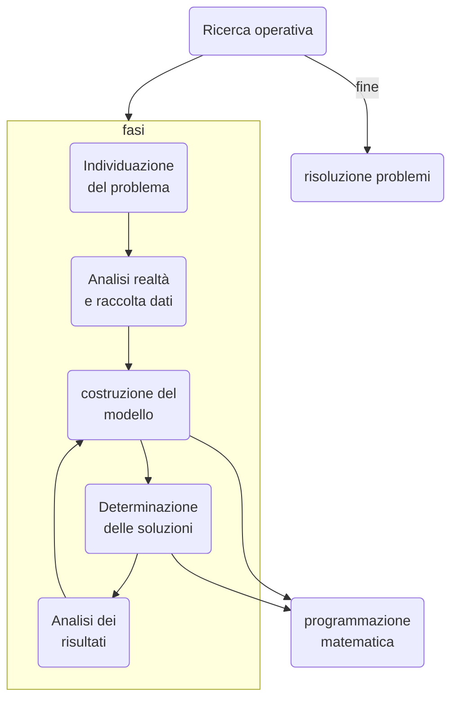

```mermaid
graph TD
    Ro(Ricerca operativa) --> |fine| rs(risoluzione problemi)
    Ro --> fasi
    subgraph fasi
        f1(Individuazione
        del problema) --> f2(Analisi realtà
        e raccolta dati) --> f3(costruzione del
        modello) --> f4(Determinazione
        delle soluzioni) --> f5(Analisi dei
        risultati) -->f3
    end
    f3 & f4 --> progmat(programmazione
    matematica)
```
