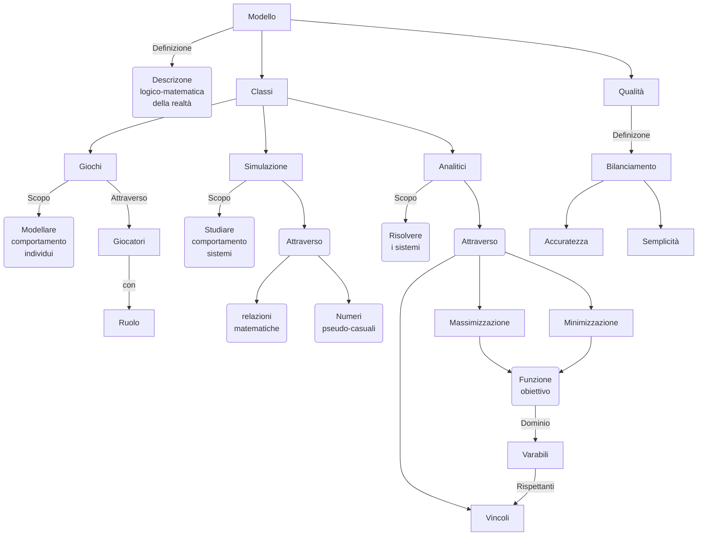
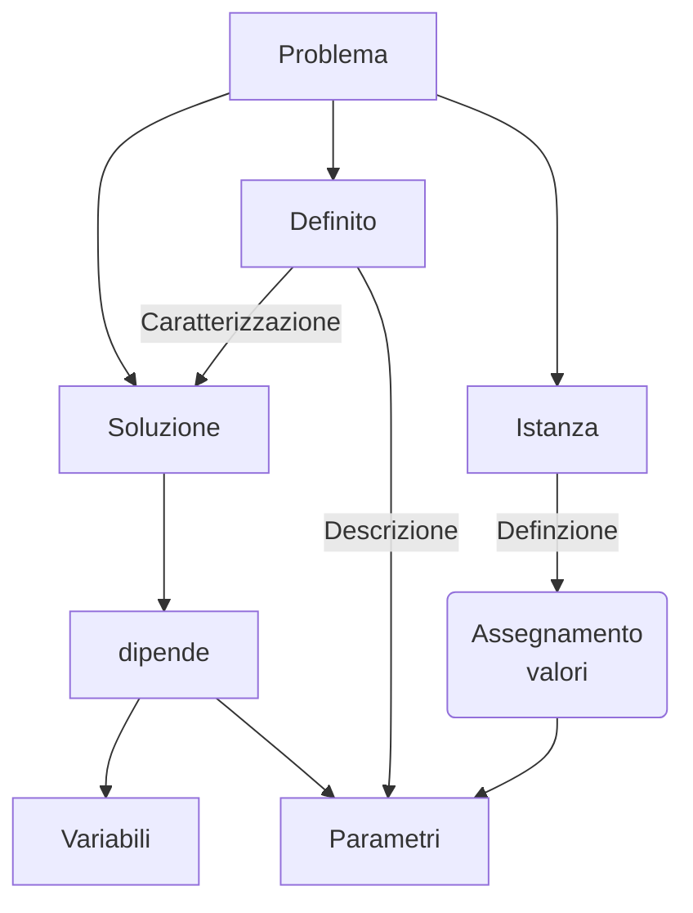
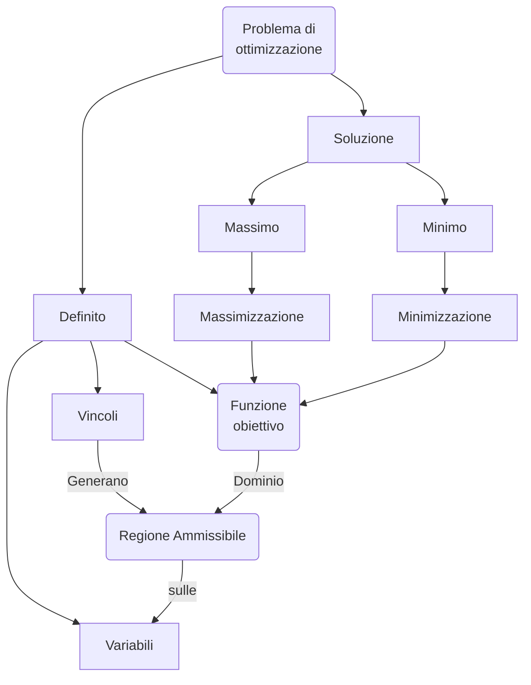
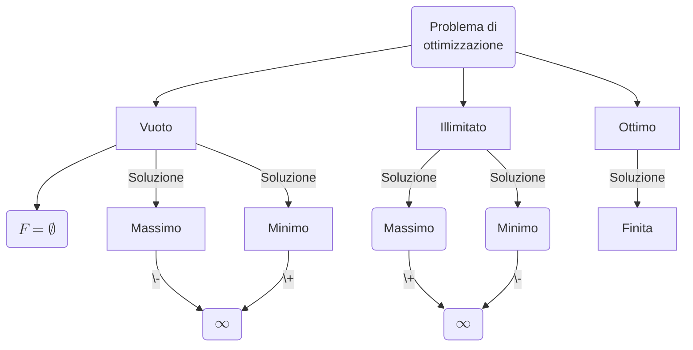

# Modello

# Problema

# Problema di ottimizzazione

Un problema di ottimizzazione è un problema definito da variabili, vincoli, che definiscono una regione ammississibile
($F$) per le variabili, ed una funzione obiettivo $s$ definita su $F$.

$$c:F\rightarrow\mathbb{R}$$

Un problema di ottimizzazione può essere di massimo:

$$max\{c(x):x\in F\}$$

Oppure di minimo: $$min\{c(x):x\in F\}$$

Un probema di massimo può essere riscritto come problema di minimo e viceversa:

$$min\{c(x):x\in F\} = -max\{-c(x):x\in F\}$$

## Soluzioni problema di ottimizzazione

# Funzioni a carico fisso

$$
f(x) = \begin{cases}
b_1 + c_1 x & \text{se } x \in [a_1, a_2] \\
b_2 + c_2 x & \text{se } x \in (a_2, a_3] \\
\vdots & \vdots \\
b_n + c_n x & \text{se } x \in (a_n, a_{n+1}]
\end{cases}
$$

## Soluzione

$$
\begin{align*}
\min \quad & \sum_{i=1}^n (b_i + c_i a_i) y_i + \sum_{i=1}^n c_i z_i \\
\text{s.t.} \quad & x = \sum_{i=1}^n a_i y_i + \sum_{i=1}^n z_i \\
& 0 \leq z_i \leq (a_{i+1} - a_i)y_i, \quad i = 1, \dots, n \\
& \sum_{i=1}^n y_i = 1 \\
& y_i \in \{0, 1\}, \quad i = 1, \dots, n
\end{align*}
$$
