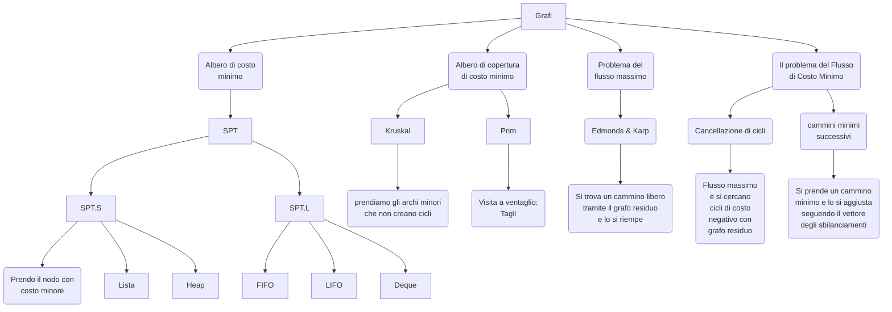

$$c(T) = \sum_{\{i,j\} \in E_T} c_{ij}$$

-   Inserzione: Inseriamo in una struttura gi archi che teniamo nell'albaro
-   Cancellazione: Inseriamo in un'altra struttura gi archi che non teniamo nell'albaro

```js
procedure S = Greedy-MST ( G , c ) {
  S = ∅;
  R = ∅;
  do{
    applica Inserzione o Cancellazione
  }while( S ∪ R ⊊ E and |S| < n − 1; )
}
```

# Algoritmo di Kruskal

```js
procedure S = Kruskal (G, c) {
  S = ∅;
  R = ∅;
  X = Sort(A);
  do {
    estrai da X il primo lato {u, v};
    if (Component(E, u, v)){
      R = R ∪ {u, v}; /* cancellazione */
    }else{
      S = S ∪ {u, v}; /* inserzione */
    }
  } while(|S| < n − 1);
}
```

# Algoritmo di Prim

```js
procedure p = Prim( G , c , r ) {
  foreach( i ∈ V ){
    p[ i ] = r; d[ i ] = M;
  }
  d[ r ] = −M ;
  Q = { r };
  do{
    seleziona u in Q tale che d[ u ] = min{ d[ j ] : j ∈ Q };
    d[ u ] = −M;
    Q = Q \ { u };
    foreach( { u , v } ∈ S( u ) ){
      if ( cuv < d[ v ] ){
        d[ v ] = cuv;
        p[ v ] = u;
        if ( v ∈/ Q ){
          Q = Q ∪ { v };
        }
      }
    }
  } while( Q ̸= ∅ );
}
```


