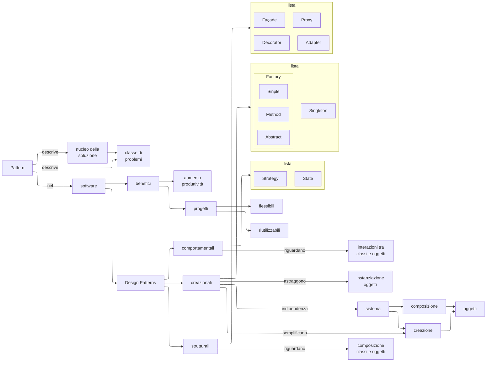
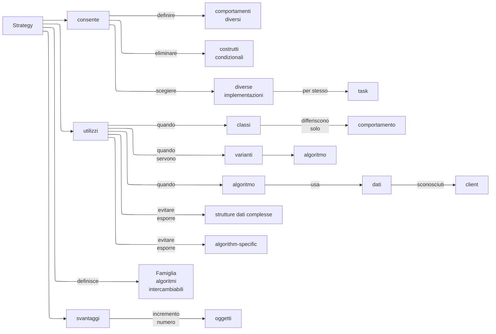
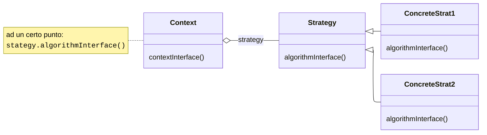
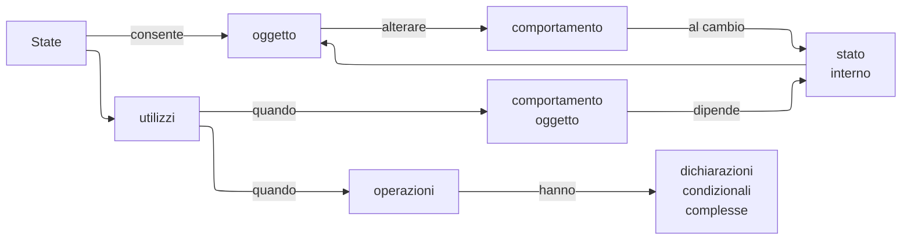
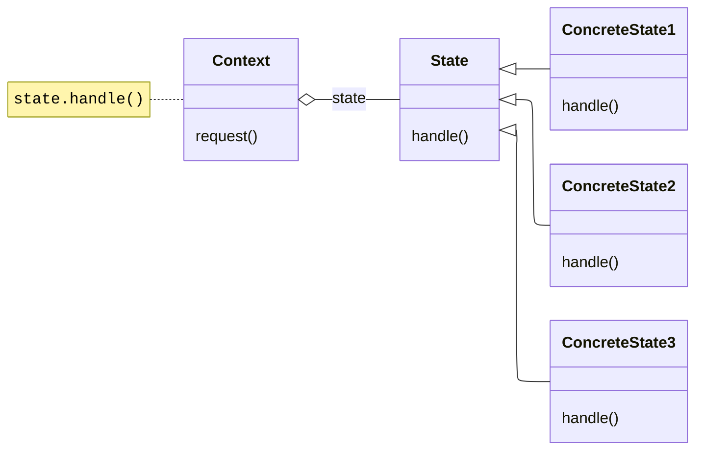
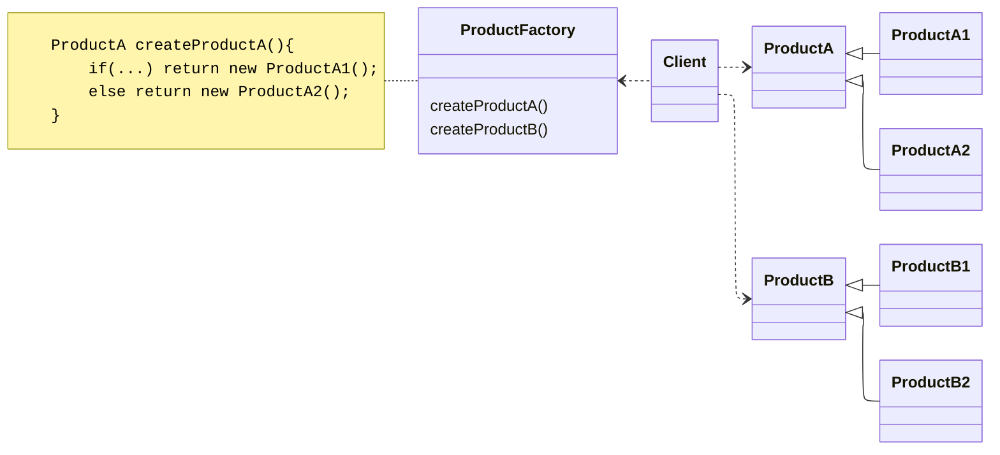
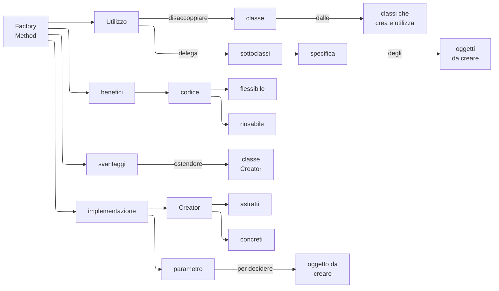
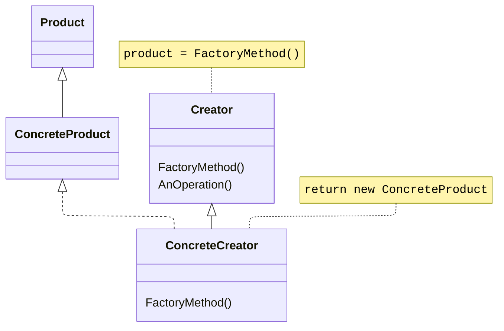
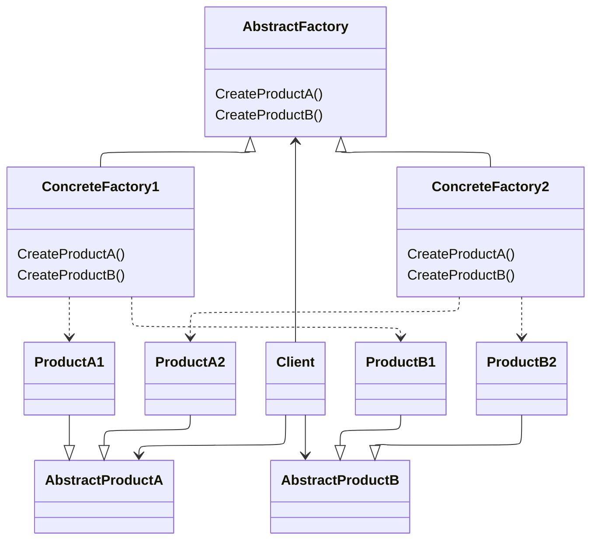
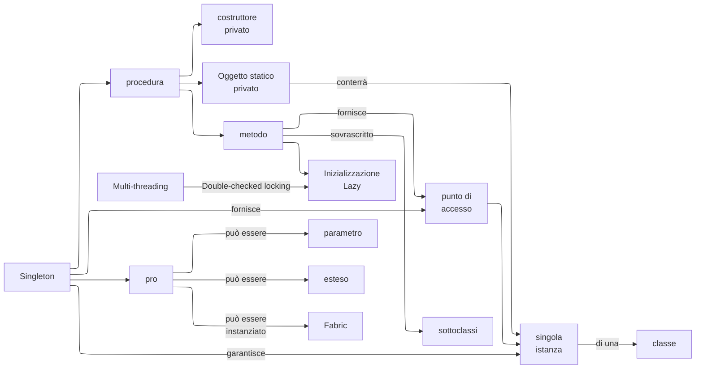

```mermaid
---
config:
    layout: elk
    elk: {
        considerModelOrder: "PREFER_NODES",
        forceNodeModelOrder: true
    }
---
graph LR

    Pattern -- descrive --> CP[classe di<br>problemi]
    Pattern -- descrive --> NS[nucleo della<br>soluzione] --> CP
    Pattern -- nel --> software --> benefici
    benefici --> AP[aumento<br>produttività]
    benefici --> progetti --> flessibili & riutilizzabili
    software --> DP[Design Patterns] --> comportamentali & creazionali & strutturali

    comportamentali -- riguardano --> ICO[interazioni tra<br>classi e oggetti]
    comportamentali --> l_2
    subgraph l_2[lista]
    direction LR
        Strategy~~~
        State
    end

    creazionali -- astraggono --> CO[instanziazione<br>oggetti]
    creazionali -- indipendenza --> sistema
    sistema --> composizione & creazione --> oggetti
    creazionali -- semplificano --> creazione
    creazionali --> l_0
    subgraph l_0[lista]
    direction LR
        subgraph Factory
        direction TB
            Sinple ~~~ Method ~~~ Abstract
        end
        Factory ~~~ Singleton
    end

    strutturali -- riguardano --> CCO[composizione<br>classi e oggetti]
    strutturali --> l_1
    subgraph l_1[lista]
    direction LR
        Decorator~~~
        Adapter
        Façade~~~
        Proxy
    end
```

# Comportamentali

## Strategy

```mermaid
---
config:
    layout: elk
    elk: {
        considerModelOrder: "PREFER_NODES",
        forceNodeModelOrder: true
    }
---
graph LR
Strategy -- definisce --> FA[Famiglia<br>algoritmi<br>intercambiabili]
Strategy --> consente
consente -- definire --> CD[comportamenti<br>diversi]
consente -- eliminare --> CC[costrutti<br>condizionali]
consente -- scegiere --> DI[diverse<br>implementazioni] -- per stesso --> task
Strategy --> utilizzi
utilizzi -- quando --> classi -- differiscono<br>solo --> comportamento
utilizzi -- quando<br>servono --> varianti --> algoritmo
utilizzi -- quando --> al[algoritmo] -- usa --> dati -- sconosciuti --> client
utilizzi -- evitare<br>esporre --> SDC[strutture dati complesse] & algorithm-specific
Strategy --> svantaggi
svantaggi -- incremento<br>numero --> oggetti
```

### Implementazione

```mermaid
---
config:
    layout: elk
    elk: {
        considerModelOrder: "PREFER_NODES",
        forceNodeModelOrder: true
    }
---
classDiagram
direction LR
    class Context{
        contextInterface()
    }
    note for Context "ad un certo punto:<br><code>stategy.algorithmInterface()</code>"
    class Strategy{
        algorithmInterface()
    }
    Context o-- Strategy:strategy
    class ConcreteStrat1{
        algorithmInterface()
    }
    Strategy <|-- ConcreteStrat1
    class ConcreteStrat2{
        algorithmInterface()
    }
    Strategy <|-- ConcreteStrat2

```

## State

```mermaid
---
config:
    layout: elk
    elk: {
        considerModelOrder: "PREFER_NODES",
        forceNodeModelOrder: true
    }
---
graph LR
State -- consente --> oggetto -- alterare --> comportamento -- al cambio --> SI[stato<br>interno]
SI --> oggetto
State --> utilizzi
utilizzi -- quando --> CO[comportamento<br>oggetto] -- dipende --> SI
utilizzi -- quando --> operazioni -- hanno --> DCC[dichiarazioni<br>condizionali<br>complesse]
```

### Implementazione

```mermaid
---
config:
    layout: elk
    elk: {
        considerModelOrder: "PREFER_EDGES",
        forceNodeModelOrder: true
    }
---
classDiagram
direction LR
    class Context{
        request()
    }
    note for Context "<code>state.handle()</code>"
    class State{
        handle()
    }
    Context o-- State:state
    class ConcreteState1{
        handle()
    }
    State <|-- ConcreteState1
    class ConcreteState2{
        handle()
    }
    State <|-- ConcreteState2
    class ConcreteState3{
        handle()
    }
    State <|-- ConcreteState3

```

# Creazionali

## Factory

### Simple

```mermaid
---
config:
    layout: elk
    elk: {
        considerModelOrder: "PREFER_NODES",
        forceNodeModelOrder: true
    }
---
classDiagram
direction LR
    class ProductFactory{
        createProductA()
        createProductB()
    }
    ProductFactory <.. Client
    Client ..> ProductA
    ProductA <|-- ProductA1
    ProductA <|-- ProductA2
    Client ..> ProductB
    ProductB <|-- ProductB1
    ProductB <|-- ProductB2
    note for ProductFactory "<pre><code>    ProductA createProductA(){
        if(...) return new ProductA1();
        else return new ProductA2();
    }</code></pre>"
```

### Method

```mermaid
---
config:
    layout: elk
    elk: {
        considerModelOrder: "PREFER_NODES",
        forceNodeModelOrder: true
    }
---
graph LR
    FM[Factory<br>Method] --> Utilizzo
    Utilizzo -- disaccoppiare --> classe -- dalle --> classi[classi che<br>crea e utilizza]
    Utilizzo -- delega --> sottoclassi --> specifica -- degli --> oggetti[oggetti<br>da creare]

    FM --> benefici
    benefici --> codice --> flessibile & riusabile

    FM --> svantaggi
    svantaggi -- estendere --> c[classe<br>Creator]

    FM --> implementazione
    implementazione --> Creator --> astratti & concreti
    implementazione --> parametro -- per decidere --> o[oggetto da<br>creare]
```

#### Implementazione

```mermaid
---
config:
    layout: elk
    elk: {
        considerModelOrder: "PREFER_NODES",
        forceNodeModelOrder: true
    }
---
classDiagram
    Product <|-- ConcreteProduct
    class Creator{
        FactoryMethod()
        AnOperation()
    }
    note for Creator "<code>product = FactoryMethod()</code>"
    class ConcreteCreator{
        FactoryMethod()
    }
    note for ConcreteCreator "<code>return new ConcreteProduct</code>"
    Creator <|-- ConcreteCreator
    ConcreteProduct <|.. ConcreteCreator
```

### Abstract

```mermaid
---
config:
    layout: elk
    elk: {
        forceNodeModelOrder: true
    }
---
classDiagram
    class AbstractFactory {
        CreateProductA()
        CreateProductB()
    }
    AbstractFactory <|-- ConcreteFactory1
    class ConcreteFactory1 {
        CreateProductA()
        CreateProductB()
    }

    ProductA1 --|> AbstractProductA
    ProductA2 --|> AbstractProductA
    class Client
    ProductB1 --|> AbstractProductB
    ProductB2 --|> AbstractProductB

    AbstractFactory <|-- ConcreteFactory2
    class ConcreteFactory2 {
        CreateProductA()
        CreateProductB()
    }

    ConcreteFactory1 ..> ProductA1
    ConcreteFactory1 ..> ProductB1

    ConcreteFactory2 ..> ProductA2
    ConcreteFactory2 ..> ProductB2

    AbstractFactory <-- Client
    Client --> AbstractProductA
    Client --> AbstractProductB
```

## Singleton

```mermaid
---
config:
    layout: elk
    elk: {
        forceNodeModelOrder: true
    }
---
graph LR
    Singleton -- garantisce --> SI[singola<br>istanza] -- di una --> classe
    Singleton -- fornisce --> PA[punto di<br>accesso] --> SI
    Singleton --> procedura --> cp[costruttore<br>privato]
    procedura --> OSP[Oggetto statico<br>privato] -- conterrà --> SI
    procedura --> metodo -- fornisce --> PA
    metodo --> IL[Inizializzazione<br>Lazy]
    Multi-threading -- Double-checked locking --> IL
    metodo -- sovrascritto --> sottoclassi
    Singleton --> pro
    pro -- può essere --> parametro
    pro -- può essere --> esteso
    pro -- può essere<br>instanziato --> Fabric
```
