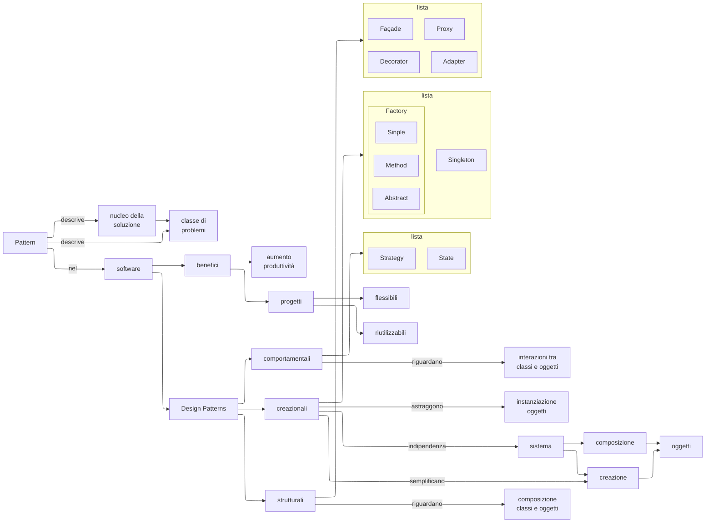
```mermaid
---
config:
    layout: elk
    elk: {
        considerModelOrder: "PREFER_NODES",
        forceNodeModelOrder: true
    }
---
graph LR

    Pattern -- descrive --> CP["classe di
problemi"]
    Pattern -- descrive --> NS["nucleo della
soluzione"] --> CP
    Pattern -- nel --> software --> benefici
    benefici --> AP["aumento
produttività"]
    benefici --> progetti --> flessibili & riutilizzabili
    software --> DP["Design Patterns"] --> comportamentali & creazionali & strutturali

    comportamentali -- riguardano --> ICO["interazioni tra
classi e oggetti"]
    comportamentali --> l_2
    subgraph l_2[lista]
    direction LR
        Strategy~~~
        State
    end

    creazionali -- astraggono --> CO["instanziazione
oggetti"]
    creazionali -- indipendenza --> sistema
    sistema --> composizione & creazione --> oggetti
    creazionali -- semplificano --> creazione
    creazionali --> l_0
    subgraph l_0[lista]
    direction LR
        subgraph Factory
        direction TB
            Sinple ~~~ Method ~~~ Abstract
        end
        Factory ~~~ Singleton
    end

    strutturali -- riguardano --> CCO["composizione
classi e oggetti"]
    strutturali --> l_1
    subgraph l_1[lista]
    direction LR
        Decorator~~~
        Adapter
        Façade~~~
        Proxy
    end
```

# Comportamentali

## Strategy

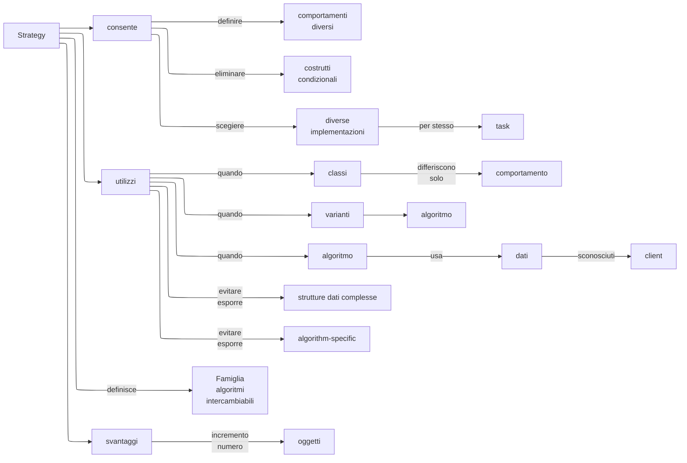
```mermaid
---
config:
    layout: elk
    elk: {
        considerModelOrder: "PREFER_NODES",
        forceNodeModelOrder: true
    }
---
graph LR
Strategy -- definisce --> FA["Famiglia
algoritmi
intercambiabili"]
Strategy --> consente
consente -- definire --> CD["comportamenti
diversi"]
consente -- eliminare --> CC["costrutti
condizionali"]
consente -- scegiere --> DI["diverse
implementazioni"] -- per stesso --> task
Strategy --> utilizzi
utilizzi -- quando --> classi -- "differiscono
solo" --> comportamento
utilizzi -- quando --> varianti --> algoritmo
utilizzi -- quando --> al["algoritmo"] -- usa --> dati -- sconosciuti --> client
utilizzi -- evitare
esporre --> SDC["strutture dati complesse"] & algorithm-specific
Strategy --> svantaggi
svantaggi -- "incremento
numero" --> oggetti
```

### Implementazione

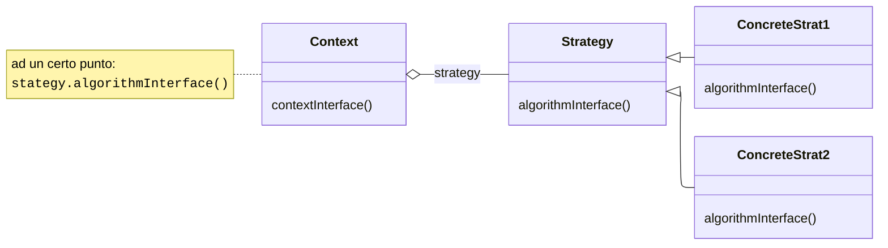
```mermaid
---
config:
    layout: elk
    elk: {
        considerModelOrder: "PREFER_NODES",
        forceNodeModelOrder: true
    }
---
classDiagram
direction LR
    class Context{
        contextInterface()
    }
    note for Context "ad un certo punto:
<code>stategy.algorithmInterface()</code>"
    class Strategy{
        algorithmInterface()
    }
    Context o-- Strategy:strategy
    class ConcreteStrat1{
        algorithmInterface()
    }
    Strategy <|-- ConcreteStrat1
    class ConcreteStrat2{
        algorithmInterface()
    }
    Strategy <|-- ConcreteStrat2
```

## State

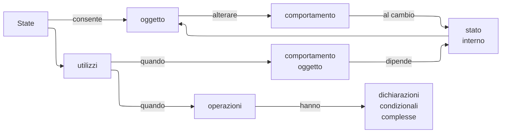
```mermaid
---
config:
    layout: elk
    elk: {
        considerModelOrder: "PREFER_NODES",
        forceNodeModelOrder: true
    }
---
graph LR
State -- consente --> oggetto -- alterare --> comportamento -- al cambio --> SI["stato
interno"]
SI --> oggetto
State --> utilizzi
utilizzi -- quando --> CO["comportamento
oggetto"] -- dipende --> SI
utilizzi -- quando --> operazioni -- hanno --> DCC["dichiarazioni
condizionali
complesse"]
```

### Implementazione

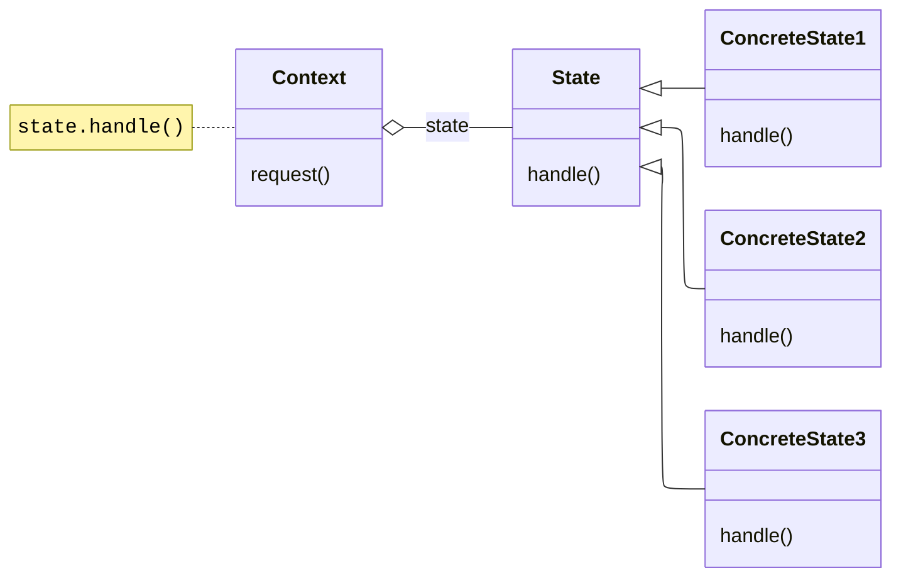
```mermaid
---
config:
    layout: elk
    elk: {
        considerModelOrder: "PREFER_NODES",
        forceNodeModelOrder: true
    }
---
classDiagram
direction LR
    class Context{
        request()
    }
    note for Context "<code>state.handle()</code>"
    class State{
        handle()
    }
    Context o-- State:state
    class ConcreteState1{
        handle()
    }
    State <|-- ConcreteState1
    class ConcreteState2{
        handle()
    }
    State <|-- ConcreteState2
    class ConcreteState3{
        handle()
    }
    State <|-- ConcreteState3
```

# Creazionali

## Factory

### Simple

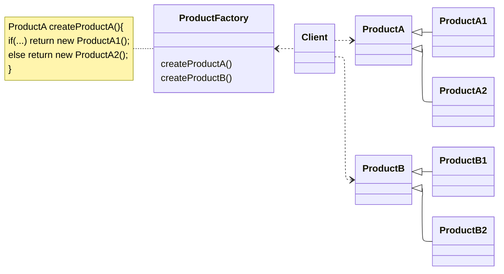
```mermaid
---
config:
    layout: elk
    elk: {
        considerModelOrder: "PREFER_NODES",
        forceNodeModelOrder: true
    }
---
classDiagram
direction LR
    class ProductFactory{
        createProductA()
        createProductB()
    }
    ProductFactory <.. Client
    Client ..> ProductA
    ProductA <|-- ProductA1
    ProductA <|-- ProductA2
    Client ..> ProductB
    ProductB <|-- ProductB1
    ProductB <|-- ProductB2
    note for ProductFactory "ProductA createProductA(){
        if(...) return new ProductA1();
        else return new ProductA2();
    }"
```

### Method

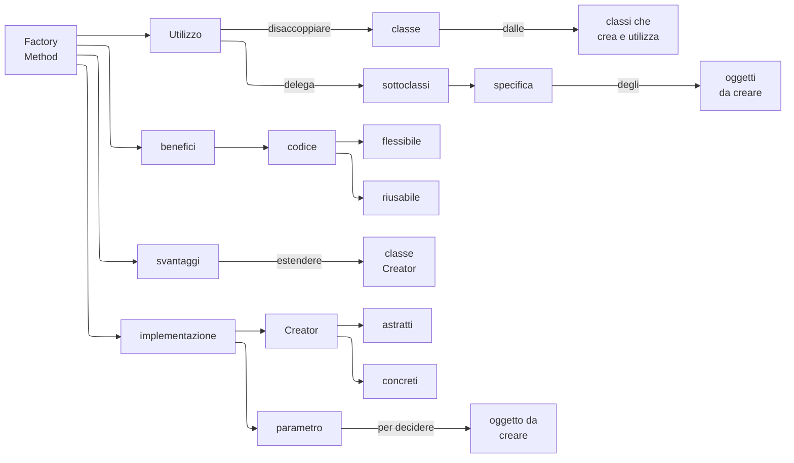
```mermaid
---
config:
    layout: elk
    elk: {
        considerModelOrder: "PREFER_NODES",
        forceNodeModelOrder: true
    }
---
graph LR
    FM["Factory
Method"] --> Utilizzo
    Utilizzo -- disaccoppiare --> classe -- dalle --> classi["classi che
crea e utilizza"]
    Utilizzo -- delega --> sottoclassi --> specifica -- degli --> oggetti["oggetti
da creare"]

    FM --> benefici
    benefici --> codice --> flessibile & riusabile

    FM --> svantaggi
    svantaggi -- estendere --> c["classe
Creator"]

    FM --> implementazione
    implementazione --> Creator --> astratti & concreti
    implementazione --> parametro -- per decidere --> o["oggetto da
creare"]
```

#### Implementazione

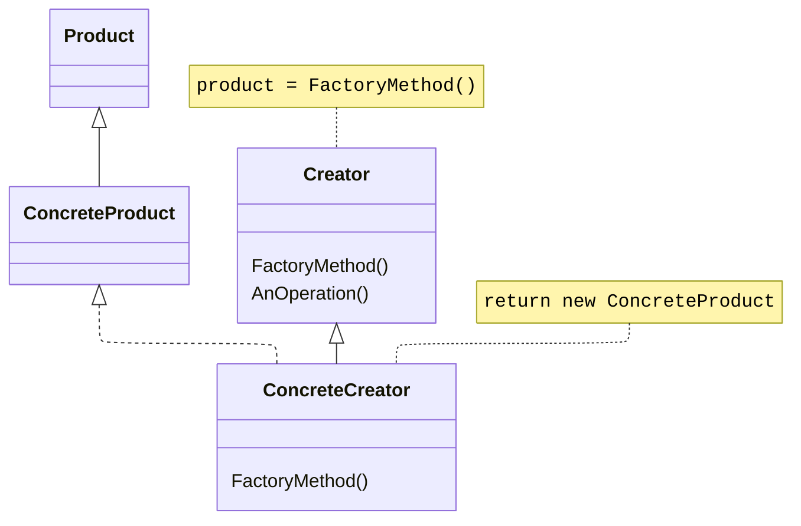
```mermaid
---
config:
    layout: elk
    elk: {
        considerModelOrder: "PREFER_NODES",
        forceNodeModelOrder: true
    }
---
classDiagram
    Product <|-- ConcreteProduct
    class Creator{
        FactoryMethod()
        AnOperation()
    }
    note for Creator "<code>product = FactoryMethod()</code>"
    class ConcreteCreator{
        FactoryMethod()
    }
    note for ConcreteCreator "<code>return new ConcreteProduct</code>"
    Creator <|-- ConcreteCreator
    ConcreteProduct <|.. ConcreteCreator
```

### Abstract

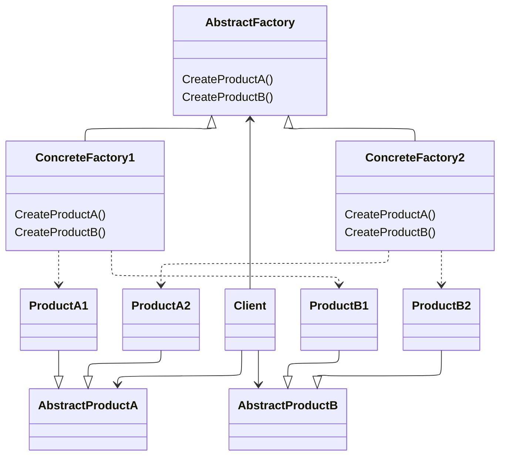
```mermaid
---
config:
    layout: elk
    elk: {
        forceNodeModelOrder: true
    }
---
classDiagram
    class AbstractFactory {
        CreateProductA()
        CreateProductB()
    }
    AbstractFactory <|-- ConcreteFactory1
    class ConcreteFactory1 {
        CreateProductA()
        CreateProductB()
    }

    ProductA1 --|> AbstractProductA
    ProductA2 --|> AbstractProductA
    class Client
    ProductB1 --|> AbstractProductB
    ProductB2 --|> AbstractProductB

    AbstractFactory <|-- ConcreteFactory2
    class ConcreteFactory2 {
        CreateProductA()
        CreateProductB()
    }

    ConcreteFactory1 ..> ProductA1
    ConcreteFactory1 ..> ProductB1

    ConcreteFactory2 ..> ProductA2
    ConcreteFactory2 ..> ProductB2

    AbstractFactory <-- Client
    Client --> AbstractProductA
    Client --> AbstractProductB
```

## Singleton

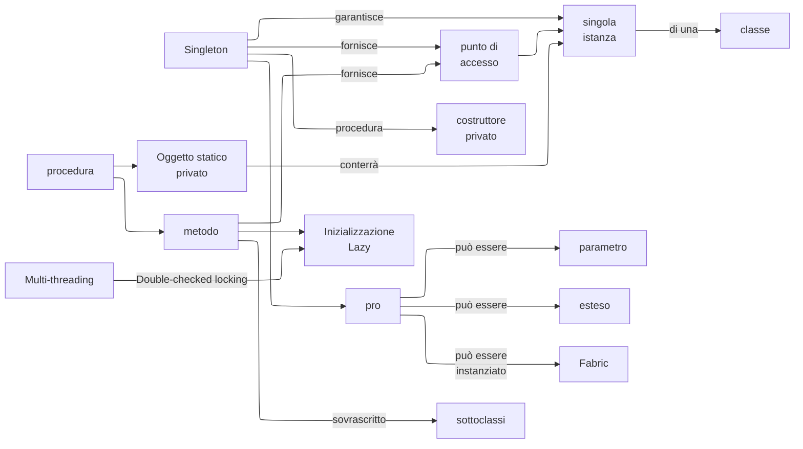
```mermaid
---
config:
    layout: elk
    elk: {
        forceNodeModelOrder: true
    }
---
graph LR
    Singleton -- garantisce --> SI["singola
istanza"] -- di una --> classe
    Singleton -- fornisce --> PA["punto di
accesso"] --> SI
    Singleton -- procedura --> cp["costruttore
privato"]
    procedura --> OSP["Oggetto statico
privato"] -- conterrà --> SI
    procedura --> metodo -- fornisce --> PA
    metodo --> IL["Inizializzazione
Lazy"]
    Multi-threading -- Double-checked locking --> IL
    metodo -- sovrascritto --> sottoclassi
    Singleton --> pro
    pro -- può essere --> parametro
    pro -- può essere --> esteso
    pro -- "può essere
    instanziato" --> Fabric
```

# Strutturali

## Decorator

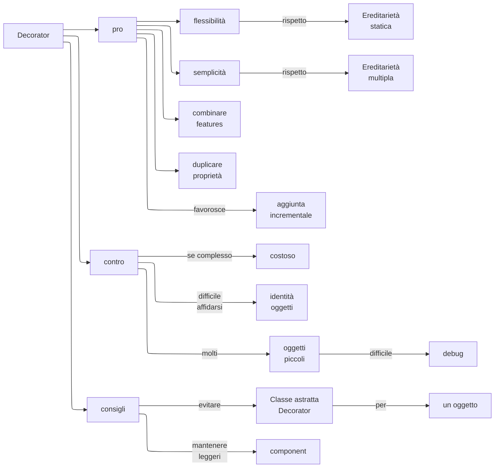
```mermaid
---
config:
    layout: elk
    elk: {
        considerModelOrder: "PREFER_NODES",
        forceNodeModelOrder: true
    }
---
graph LR

Decorator --> pro --> flessibilità -- rispetto --> ES["Ereditarietà
statica"]
pro --> semplicità -- rispetto --> EM["Ereditarietà
multipla"]
pro --> cf["combinare
features"] & dp["duplicare
proprietà"]
pro -- favorosce --> ai["aggiunta
incrementale"]
Decorator --> contro -- se complesso --> costoso
contro -- "difficile
affidarsi" --> io["identità
oggetti"]
contro -- molti --> op["oggetti
piccoli"] -- difficile --> debug
Decorator --> consigli -- evitare --> CD["Classe astratta
Decorator"] -- per --> ug[un oggetto]
consigli -- "mantenere
leggeri" --> component
```

### Implementazione

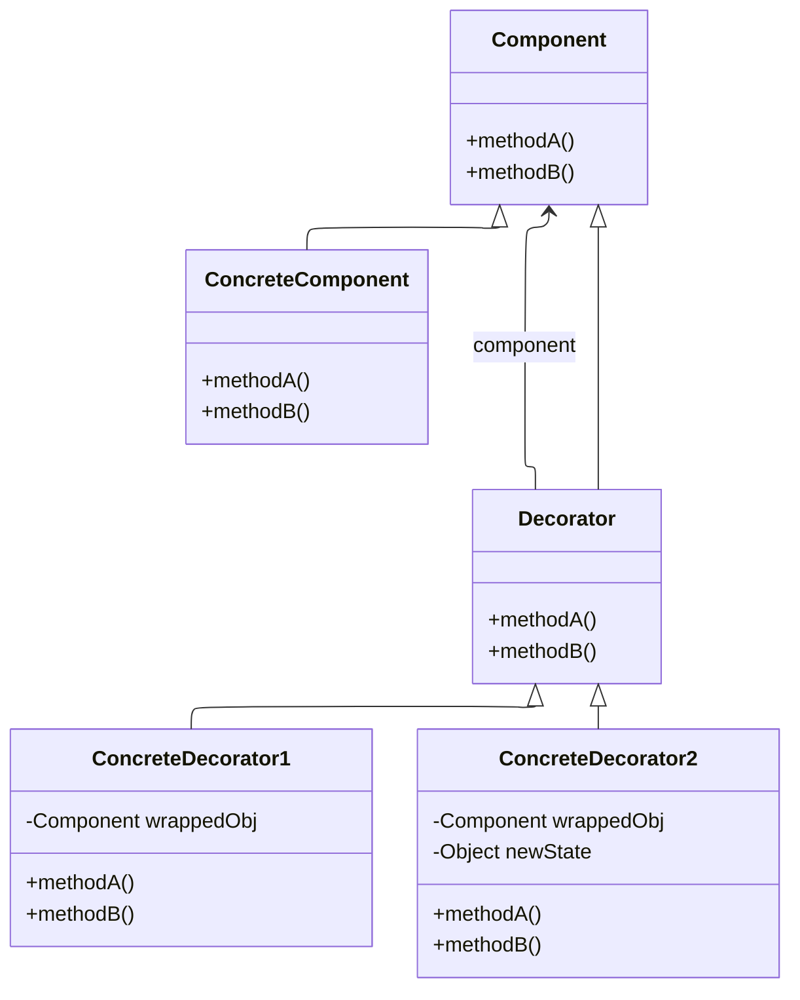
```mermaid
---
config:
    layout: elk
    elk: {
        considerModelOrder: "PREFER_NODES",
        forceNodeModelOrder: true
    }
---
classDiagram
class Component{
    +methodA()
    +methodB()
}
class ConcreteComponent{
    +methodA()
    +methodB()
}
class Decorator{
    +methodA()
    +methodB()
}
class ConcreteDecorator1{
    -Component wrappedObj
    +methodA()
    +methodB()
}
class ConcreteDecorator2{
    -Component wrappedObj
    -Object newState
    +methodA()
    +methodB()
}

Component <|-- ConcreteComponent
Component <|-- Decorator
Decorator <|-- ConcreteDecorator1
Decorator <|-- ConcreteDecorator2
Component <-- Decorator: component
```

## Adapter & Façade

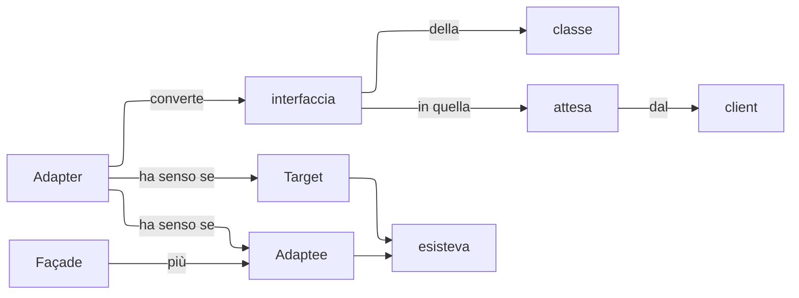
```mermaid
---
config:
    layout: elk
    elk: {
        considerModelOrder: "PREFER_NODES",
        forceNodeModelOrder: true
    }
---
graph LR
Adapter -- converte --> interfaccia -- della --> classe
interfaccia -- in quella --> attesa -- dal --> client
Adapter -- ha senso se --> Target & Adaptee --> esisteva
Façade -- più --> Adaptee
```

### Implementazione

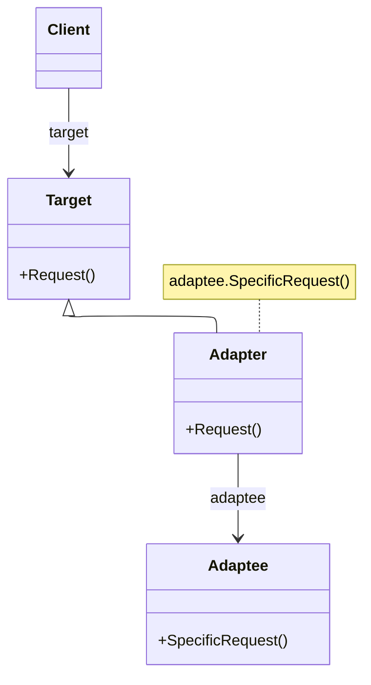
```mermaid
---
config:
    layout: elk
    elk: {
        considerModelOrder: "PREFER_NODES",
        forceNodeModelOrder: true
    }
---
classDiagram
Client --> Target: target
class Target{
    +Request()
}
class Adapter{
    +Request()
}
class Adaptee{
    +SpecificRequest()
}
Target <|-- Adapter
Adapter --> Adaptee: adaptee
note for Adapter "adaptee.SpecificRequest()"
```

## Proxy

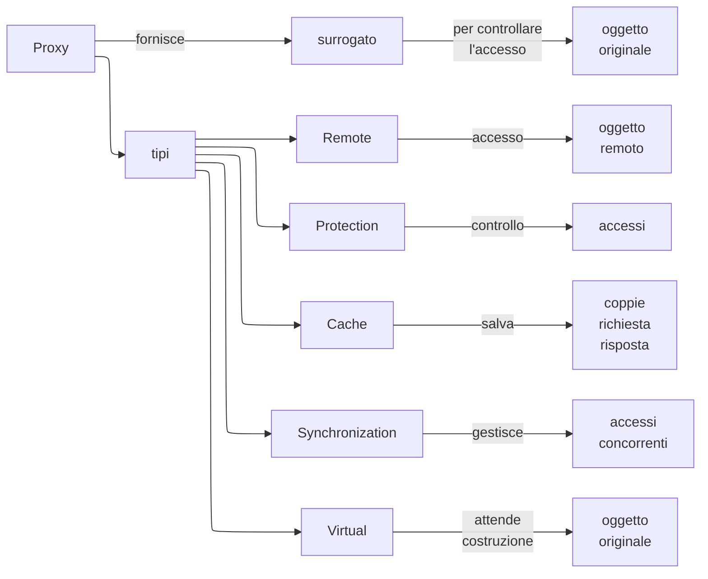
```mermaid
---
config:
    layout: elk
    elk: {
        considerModelOrder: "PREFER_NODES",
        forceNodeModelOrder: true
    }
---
graph LR

Proxy -- fornisce --> surrogato -- "per controllare
l'accesso" --> oo["oggetto
originale"]
Proxy --> tipi
tipi --> Remote & Protection & Cache & Synchronization & Virtual

Remote -- accesso --> or["oggetto
remoto"]
Protection -- controllo --> accessi
Cache -- salva --> CRR["coppie
richiesta
risposta"]
Synchronization -- gestisce --> AC["accessi
concorrenti"]
Virtual -- "attende
costruzione" --> OO["oggetto
originale"]
```

### Implementazione

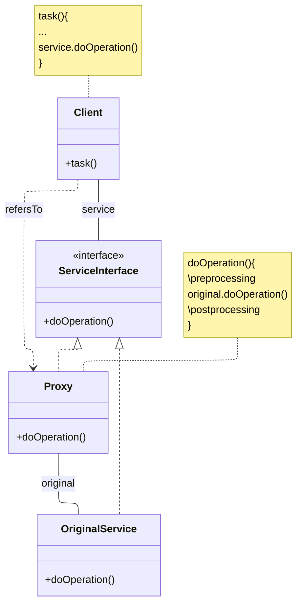
```mermaid
---
config:
    layout: elk
    elk: {
        considerModelOrder: "PREFER_NODES",
        forceNodeModelOrder: true
    }
---
classDiagram
class Client{
    +task()
}
class ServiceInterface{
    <<interface>>
    +doOperation()
}
class Proxy{
    +doOperation()
}
class OriginalService{
    +doOperation()
}

Client -- ServiceInterface: service
ServiceInterface <|.. Proxy
ServiceInterface <|.. OriginalService
Proxy -- OriginalService: original
Client ..> Proxy: refersTo


note for Client "task(){
...
service.doOperation()
}"

note for Proxy "doOperation(){
\\preprocessing
original.doOperation()
\\postprocessing
}"

```

### Modello dinamico

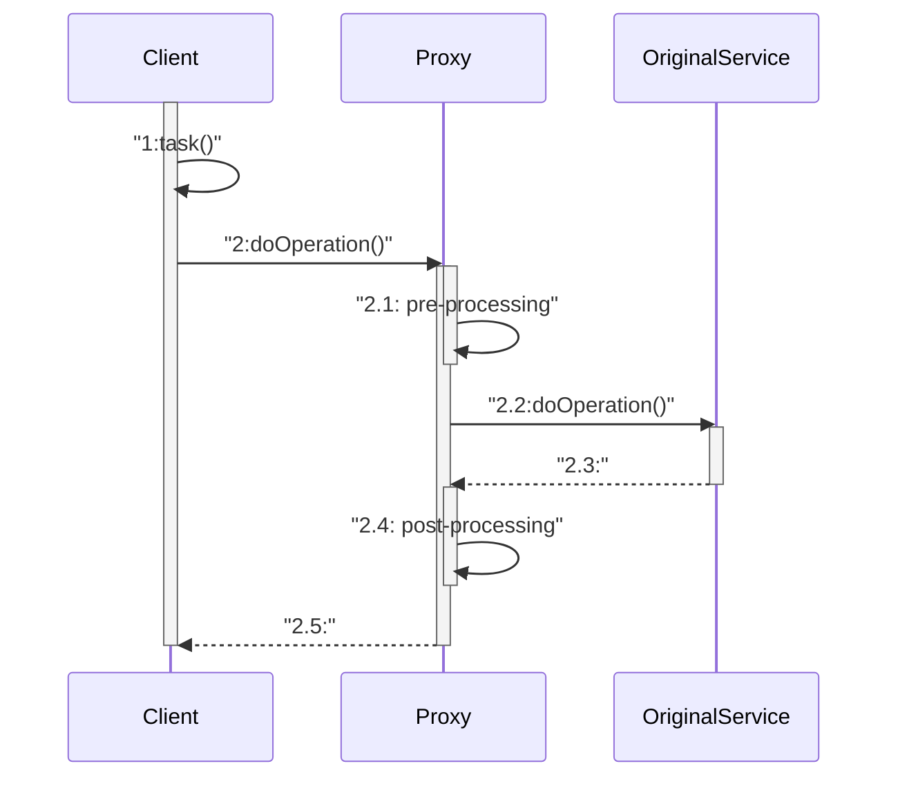
```mermaid
---
config:
    layout: elk
---
sequenceDiagram
activate Client
Client ->> Client: "1:task()"
Client ->> Proxy: "2:doOperation()"
activate Proxy
activate Proxy
Proxy ->> Proxy: "2.1: pre-processing"
deactivate Proxy
Proxy ->> OriginalService: "2.2:doOperation()"
activate OriginalService
OriginalService -->> Proxy: "2.3:"
deactivate OriginalService
activate Proxy
Proxy ->> Proxy: "2.4: post-processing"
deactivate Proxy
Proxy -->> Client: "2.5:"
deactivate Proxy
deactivate Client
```
