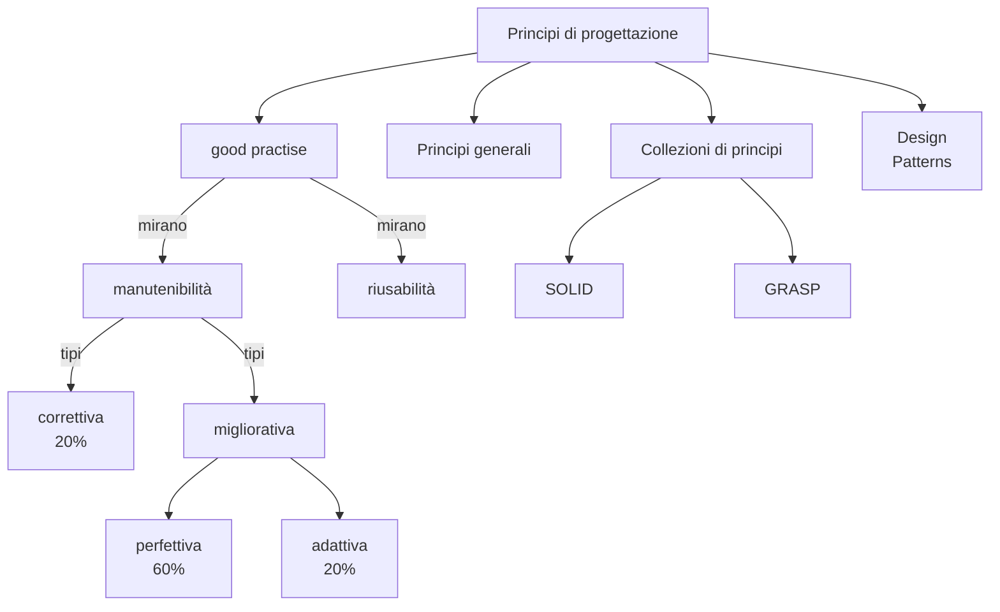
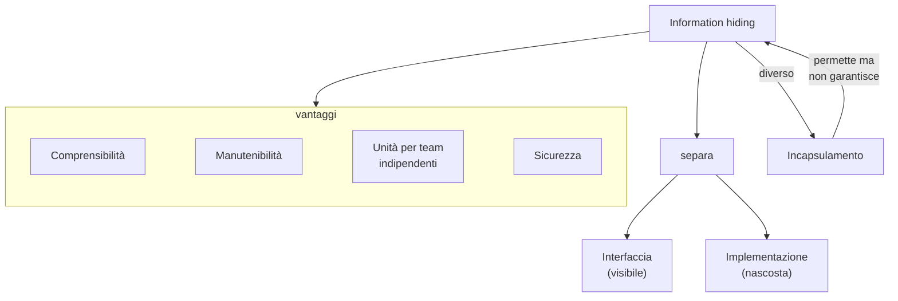
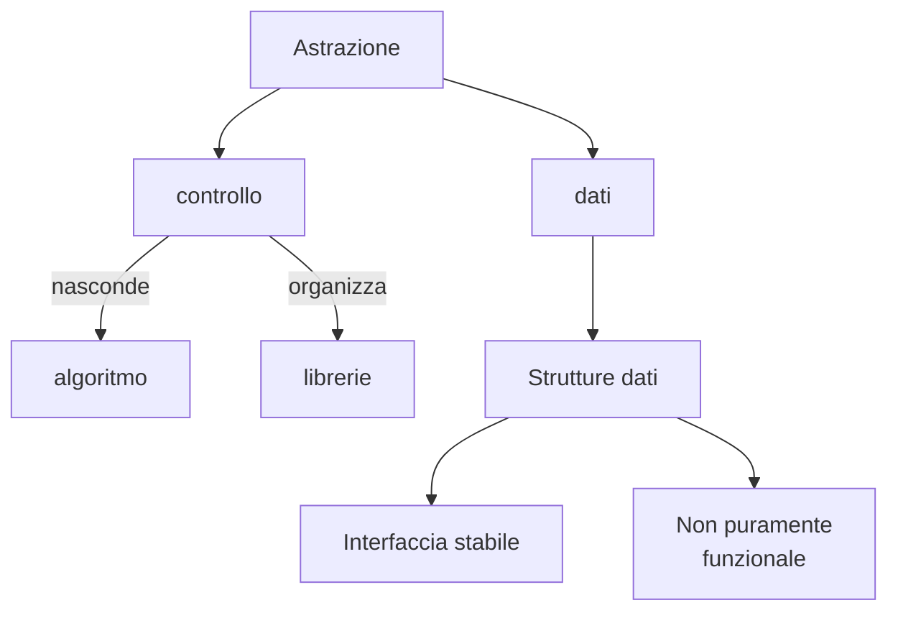
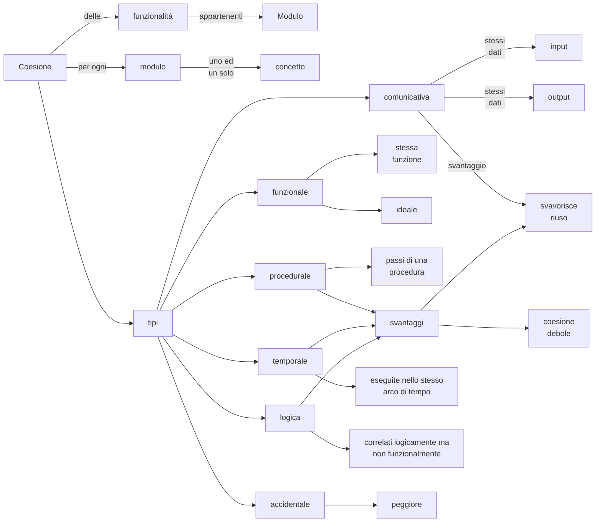
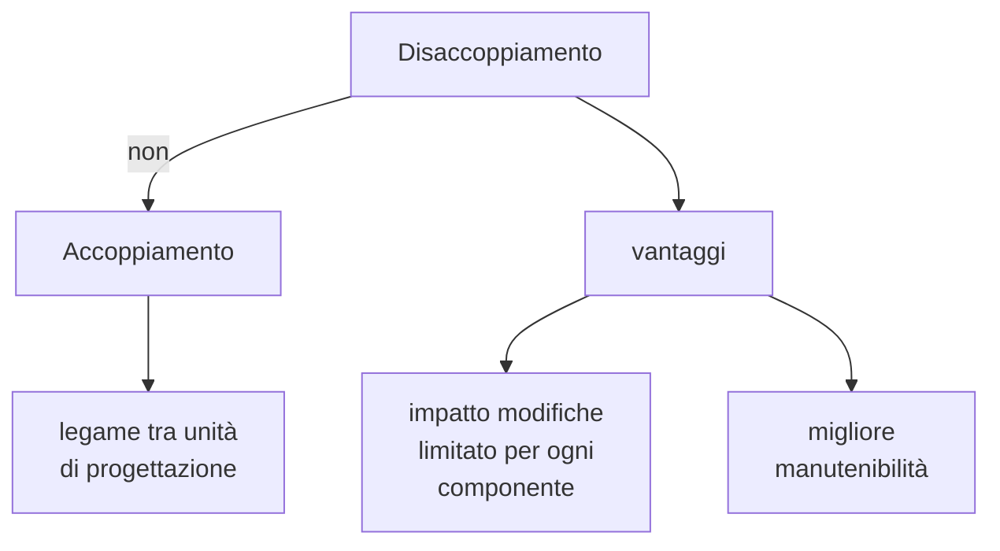
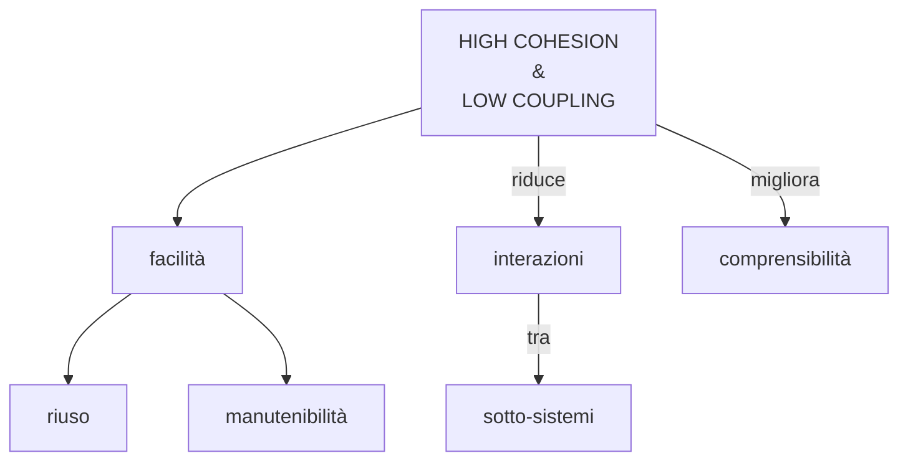
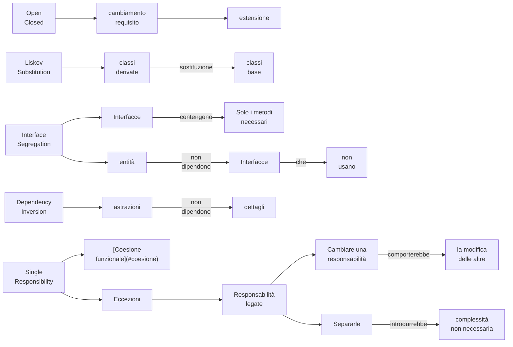
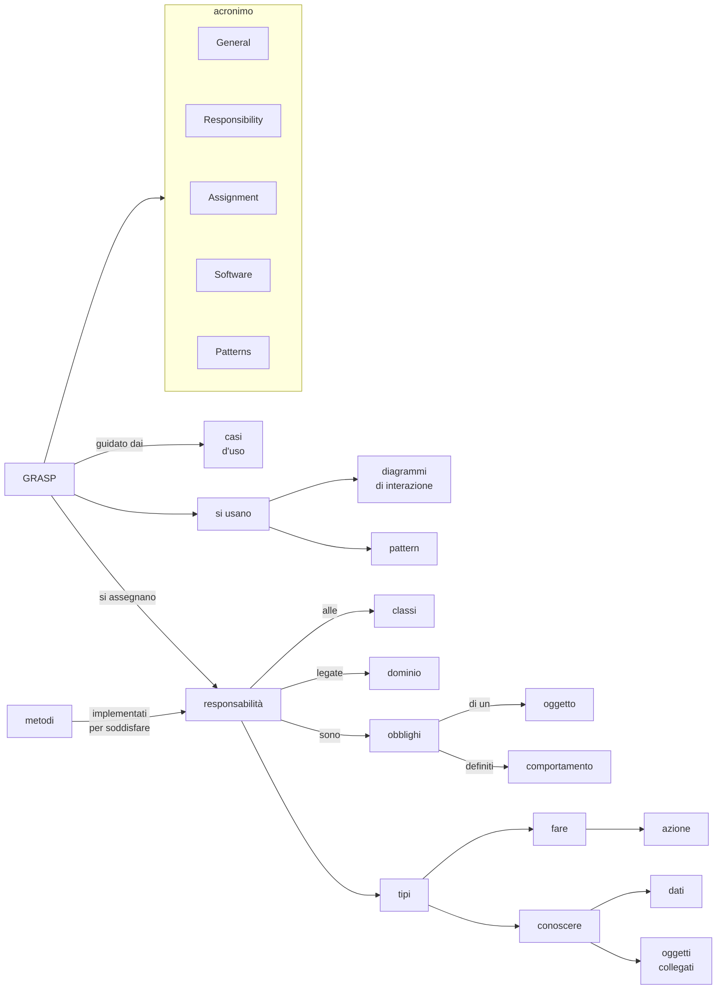

```mermaid
flowchart TD

    PP[Principi di progettazione] --> gp[good practise] -- mirano --> manutenibilità & riusabilità
    manutenibilità --tipi--> correttiva["correttiva
20%"] & migliorativa
    migliorativa --> perfettiva["perfettiva
60%"] & adattiva["adattiva
20%"]

    PP --> PG["Principi generali"]

    PP --> CP[Collezioni di principi] --> SOLID["SOLID"] & GRASP["GRASP"]

    PP --> DP["Design
Patterns"]
```

# Principi generali

## Information hiding

```mermaid
flowchart TD

    IH[Information hiding] --> separa --> Interfaccia["Interfaccia
(visibile)"] & Implementazione["Implementazione
(nascosta)"]
    IH --> vantaggi
    subgraph vantaggi
        Comprensibilità ~~~
        Manutenibilità ~~~
        UT["Unità per team
indipendenti"] ~~~
        Sicurezza
    end
    IH -- diverso --> Incapsulamento --"permette ma
    non garantisce"--> IH

```

## Astrazione

```mermaid
flowchart TD
    Astrazione --> dati & controllo
    controllo -- nasconde --> algoritmo
    controllo -- organizza --> librerie
    dati --> SD[Strutture dati] --> IS[Interfaccia stabile] & NF[Non puramente
    funzionale]
```

## Coesione

```mermaid
flowchart LR
    Coesione -- delle --> funzionalità -- appartenenti --> Modulo
    Coesione -- per ogni --> modulo -- "uno ed
un solo" --> concetto
    Coesione --> tipi --> funzionale & comunicativa & procedurale & temporale & logica & accidentale
    funzionale --> fun["stessa
funzione"]
    funzionale --> ideale
    comunicativa -- "stessi
dati" --> input & output
    comunicativa -- svantaggio --> sr["svavorisce
riuso"]
    procedurale --> pp["passi di una
procedura"]
    procedurale --> svantaggi --> cd["coesione
debole"] & sr
    temporale --> et["eseguite nello stesso
arco di tempo"]
    temporale --> svantaggi
    logica --> clnf["correlati logicamente ma
non funzionalmente"]
    logica --> svantaggi
    accidentale --> peggiore
```

## Disaccoppiamento

```mermaid
graph TD

Disaccoppiamento -- non --> Accoppiamento
Accoppiamento --> daf_ac["legame tra unità
di progettazione"]
Disaccoppiamento --> vantaggi --> imp_mod["impatto modifiche
limitato per ogni
componente"] & man["migliore
manutenibilità"]
```

## Mantra

```mermaid
graph TD

HCLC["HIGH COHESION
&
LOW COUPLING"]
HCLC --> facilità --> riuso & manutenibilità
HCLC -- riduce --> interazioni -- tra --> sotto-sistemi
HCLC -- migliora --> comprensibilità
```

# Collezioni di principi

## SOLID

```mermaid
graph LR
S["Single
Responsibility"]
O["Open
Closed"]
L["Liskov
Substitution"]
I["Interface
Segregation"]
D["Dependency
Inversion"]

O --> CR["cambiamento
requisito"] --> estensione
L --> CD["classi
derivate"] -- sostituzione --> CB["classi
base"]
I --> Interfacce -- contengono --> MN["Solo i metodi
necessari"]
I --> I_ent["entità"] -- "non
dipendono" --> In["Interfacce"] -- che --> nu["non
usano"]
D --> astrazioni -- "non
dipendono" --> dettagli

S --> CF["[Coesione
funzionale](#coesione)"]
S --> Eccezioni --> RL["Responsabilità
legate"]
RL --> NC["Cambiare una
responsabilità"] -- comporterebbe --> ma["la modifica
delle altre"]
RL --> Separarle -- introdurrebbe --> CNN["complessità
non necessaria"]
```

## GRASP

```mermaid
graph LR
    GRASP --> acronimo
    subgraph acronimo
    direction TB
        General ~~~
        Responsibility ~~~
        Assignment ~~~
        Software ~~~
        Patterns
    end
    GRASP -- guidato dai --> CU["casi
d'uso"]
    GRASP --> su["si usano"] --> di["diagrammi
di interazione"] & pattern
    GRASP -- si assegnano --> responsabilità -- alle --> classi
    responsabilità -- legate --> dominio
    responsabilità -- sono --> obblighi
    obblighi -- di un --> oggetto
    obblighi -- definiti --> comportamento
    responsabilità --> tipi --> fare & conoscere
    fare --> azione
    conoscere --> dati & OC["oggetti
collegati"]
    metodi -- "implementati
per soddisfare" --> responsabilità
```
