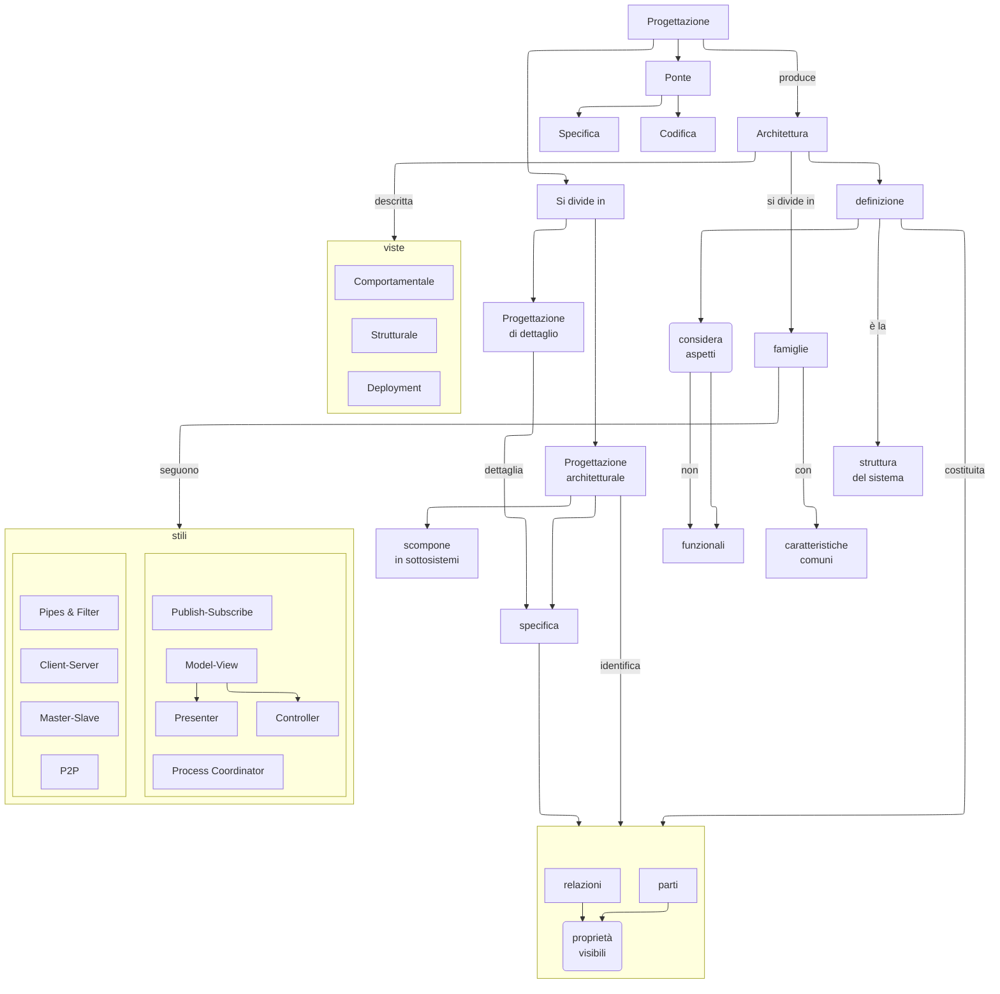

# Viste

## Comportamentale

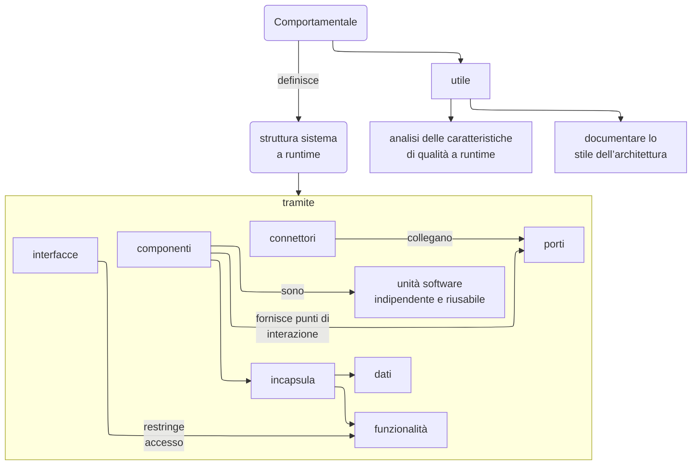

---

## Strutturale

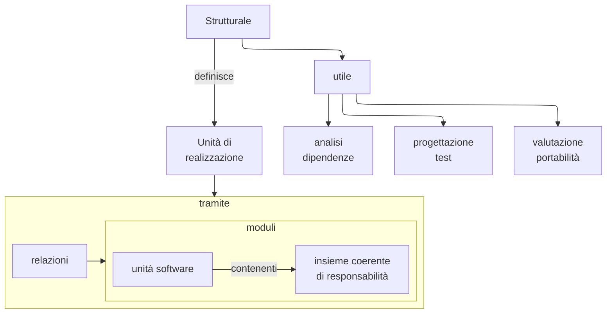

---

## Deploymenti

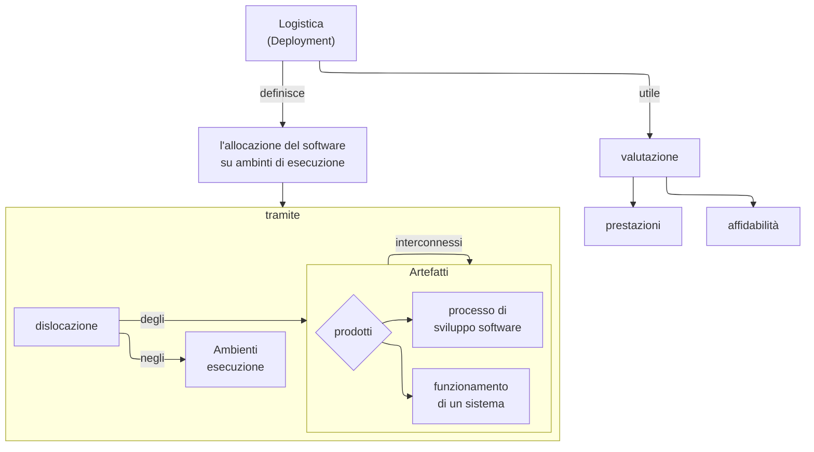

# stili

## Pipes & Filter

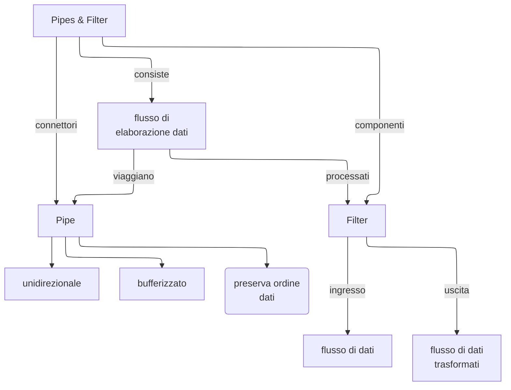

## Client-Server

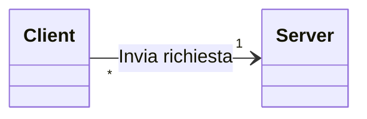

### Server

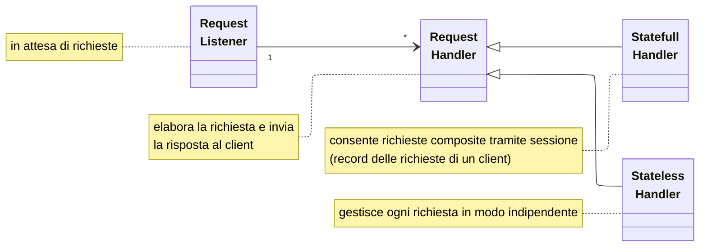

## Master-Slave

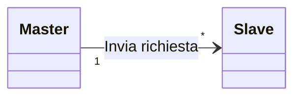

## P2P

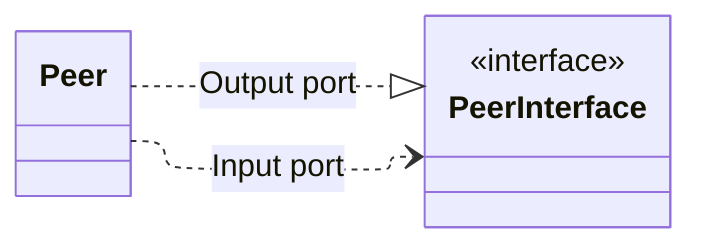

## Publish-Subscriber

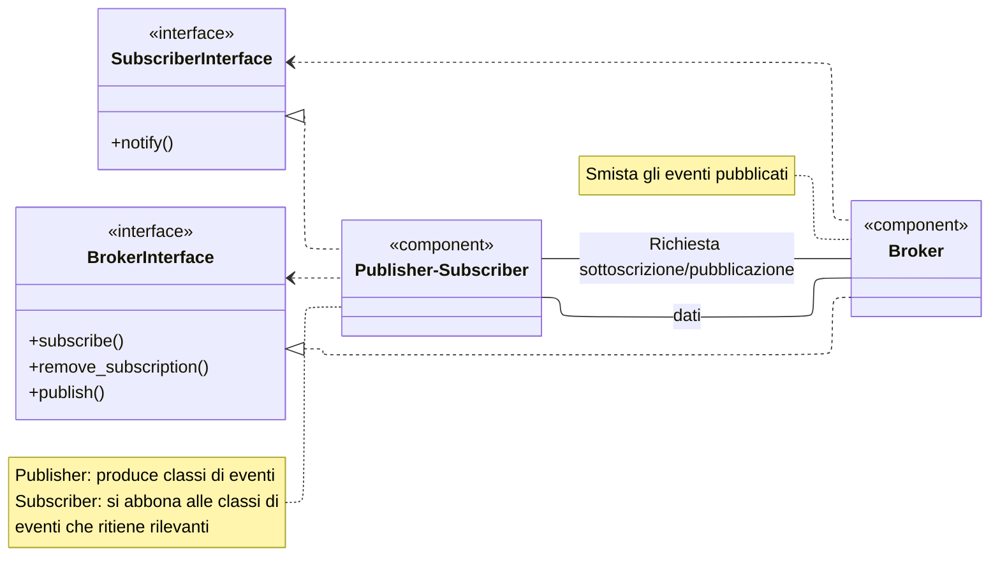

### Publisher e Subscriber distinti (PUSH)

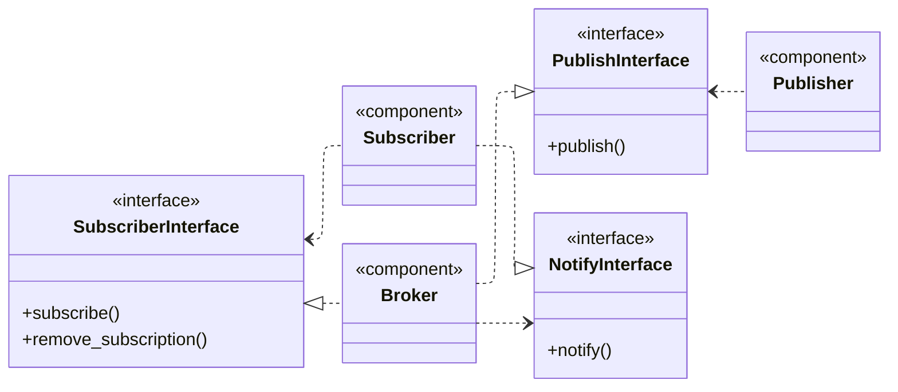

## Model-View-Controller

```d2
    grid-columns: 2
    style{
        fill: transparent
    }
    *{
        style{
            fill: transparent
        }
    }
    classes {
        *{
            style{
                fill: transparent
                stroke-width: 0
            }
        }
        empty {
            label: ""
            style: {
                fill: transparent
            }
        }
        User{
            shape: person
            style.stroke-width: 3
            height: 120
        }
        View{
            style{
                fill: lightgreen
                font-color: green
            }
        }
        Model{
            style{
                fill: yellow
                font-color: darkorange
            }
        }
    }
    model-view-controller{
        grid-rows: 3
        grid-columns: 3
        vertical-gap: 80
        style.stroke-width: 0
        empty1.class:empty
        user.class: User
        empty2.class:empty
        empty3.class:empty
        view.class:View
        empty4.class:empty
        Controller{
            style{
                fill: orange
                font-color: darkred
                stroke: transparent
            }
        }
        empty5.class:empty
        model.class:Model
        user -> view: user interaction
        view -> controller: passes calls to
        controller -> model: manipulates
        model -> view: fire events {
            style{
                stroke-dash: 3
            }
        }
    }
    model-view-presenter {
        style.stroke-width: 0
        user.class: User
        view.class:View
        Presenter{
            style{
                fill: lightblue
                font-color: blue
                stroke: transparent
            }
        }
        model.class:Model

        user -> view: user interaction
        view -> Presenter: passes calls to
        Presenter -> model: manipulates
        Presenter -> view: updates
        model -> Presenter: fire events {
            style{
                stroke-dash: 3
            }
        }
    }
```

## Process coordinator

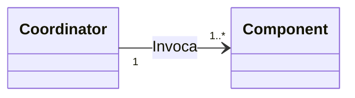
