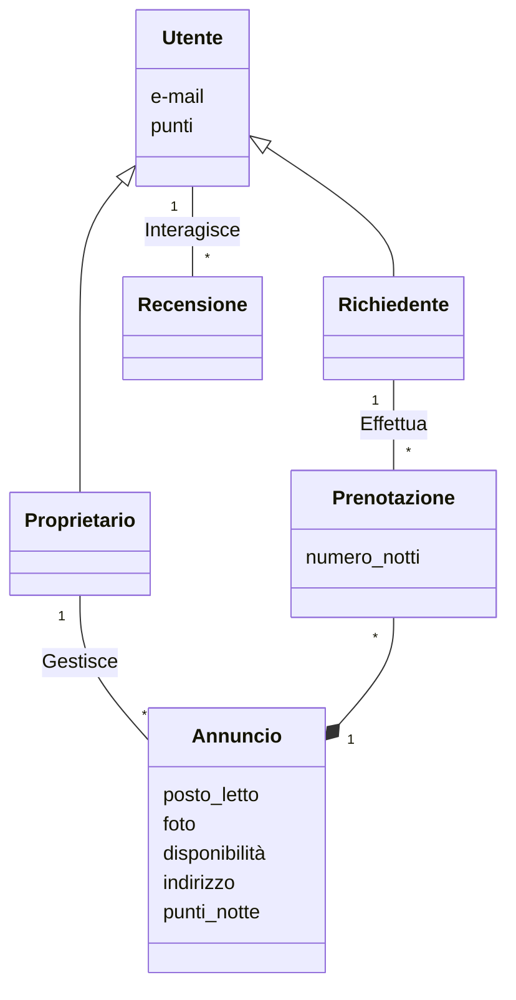

# Testo

**UniRoomShare** è un'applicazione che consente di richiedere un **alloggio** in una **città universitaria** diversa da
quella in cui si studia, insieme ad altri **studenti**. Ogni **soggiorno** non può superare le **7 notti**. Gli
**studenti** si registrano sull'app utilizzando il loro **indirizzo e-mail universitario ufficiale** per certificare che
sono effettivamente **studenti universitari**. Non vi è alcun scambio di denaro; gli studenti ricevono un certo numero
di **punti** gratuiti quando si registrano sull'app, spendono punti quando utilizzano una stanza e guadagnano punti
quando lasciano che la loro stanza venga utilizzata. Uno studente che offre una stanza o un divano in salotto deve
pubblicare alcune **foto, i periodi di disponibilità, l'indirizzo e il numero di punti per notte**. Potrebbero essere
applicati costi diversi a seconda che vengano forniti o meno lenzuola e asciugamani. Per ogni soggiorno, UniRoomShare
riceve il 10% dei punti “pagati” da uno studente. Gli studenti possono acquistare punti tramite UniRoomShare, ma non
possono venderli, solo utilizzare i punti guadagnati per un soggiorno. Sia gli ospiti che i padroni di casa possono
lasciare un **feedback**.

# Analisi requisiti

## Introduzione

Sistema software che permette agli studenti universitari di trovare e cedere alloggi tramite l'utilizzo di punti.

## Glossario

-   **Posto letto**: letto, divano, stanza
-   **Utente**: Studente dotato di un indirizzo e-mail universitario ufficiale
-   **Proprietario**: Utente che mette a disposizione un posto letto
-   **Richiedente**: Utente che richiede un posto letto
-   **Punti**: Valuta interna al sistema
-   **Annuncio**: descrizione del posto letto offerto tramite aggiunta di foto, periodo di disponibilità, indirizzo e
    numero punti per notte
-   **Prenotazione**: prenotazione del posto letto di un determinato annuncio da parte del richiedente verso il
    proprietario
-   **Recensione**: valutazione testuale dell’esperienza dell'utente

## Requisiti funzionali

1. ### Autenticazione:
    1. Il sistema deve consentire la registrazione all'utente
    2. Il sistema, durante la registrazione, deve verificare la validità dell'e-mail universitaria
    3. Il sistema deve consentire l'accesso agli utenti registrati
2. ### Gestione annunci:
    1. Il sistema deve consentire la creazione di annunci al proprietario
    2. Il sistema deve consentire la visualizzazione degli annunci all'utente
    3. Il sistema deve consentire la prenotazione al richiedente
    4. Il sistema, in fase di prenotazione, deve verificare che la città dell'annuncio sia diversa da quella del
       richiedente
    5. Il sistema, in fase di prenotazione, deve verificare che il soggiorno del richiedente non superi le 7 notti
3. ### Gestione punti:
    1. Il sistema deve assegnare un numero arbitrario di punti al momento della registrazione
    2. Il sistema deve assegnare al proprietario il 90% dei punti indicato nell'annuncio al termine della prenotazione
    3. Il sistema deve detrarre al richiedente il numero di punti indicato nell'annuncio al termine della prenotazione
    4. Il sistema deve consentire l'acquisto dei punti solo dal sistema stesso
4. ### Recensioni:
    1. Il sistema deve consentire la creazione di recensioni all'utente
    2. Il sistema deve consentire la visualizzazione di recensioni all'utente

## Requisiti non funzionali

1. Il sistema si deve integrare con sistemi esterni
2. Il sistema deve garantire la sicurezza dei dati personali degli utenti
3. Il sistema deve essere accessibile da dispositivi mobili
4. Il sistema deve garantire un’elevata disponibilità del servizio

## Diagramma dei casi d'uso

## Diagramma delle classi

