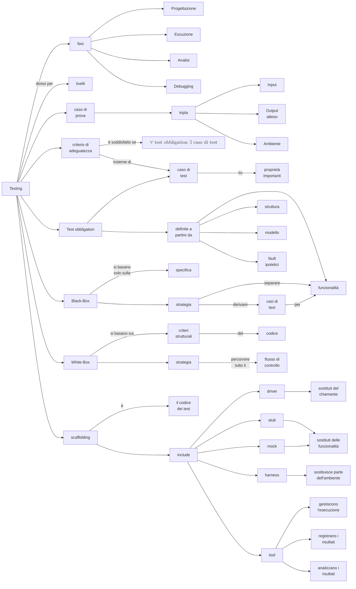
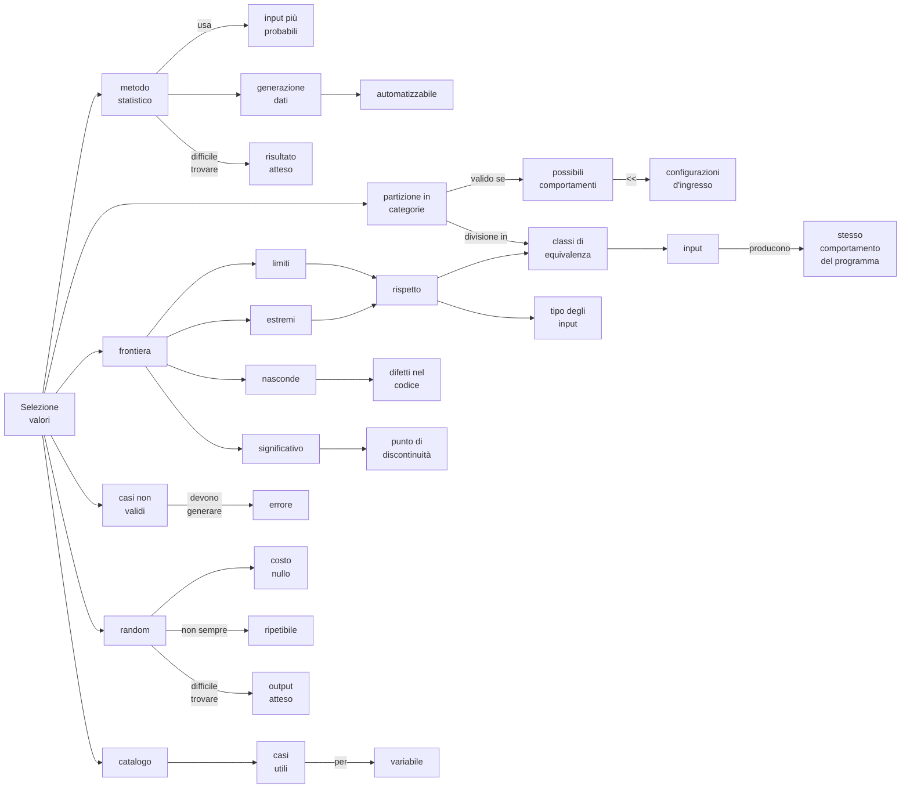
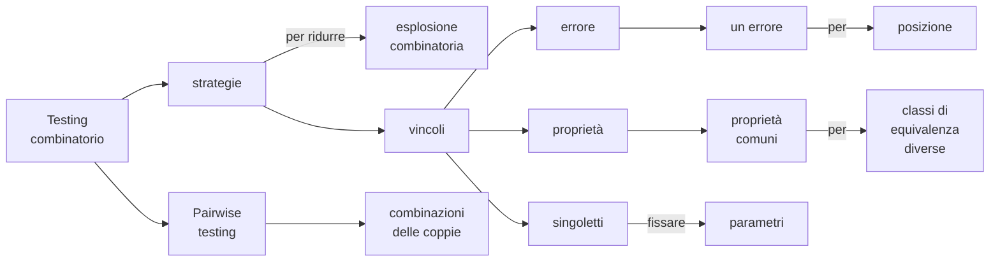
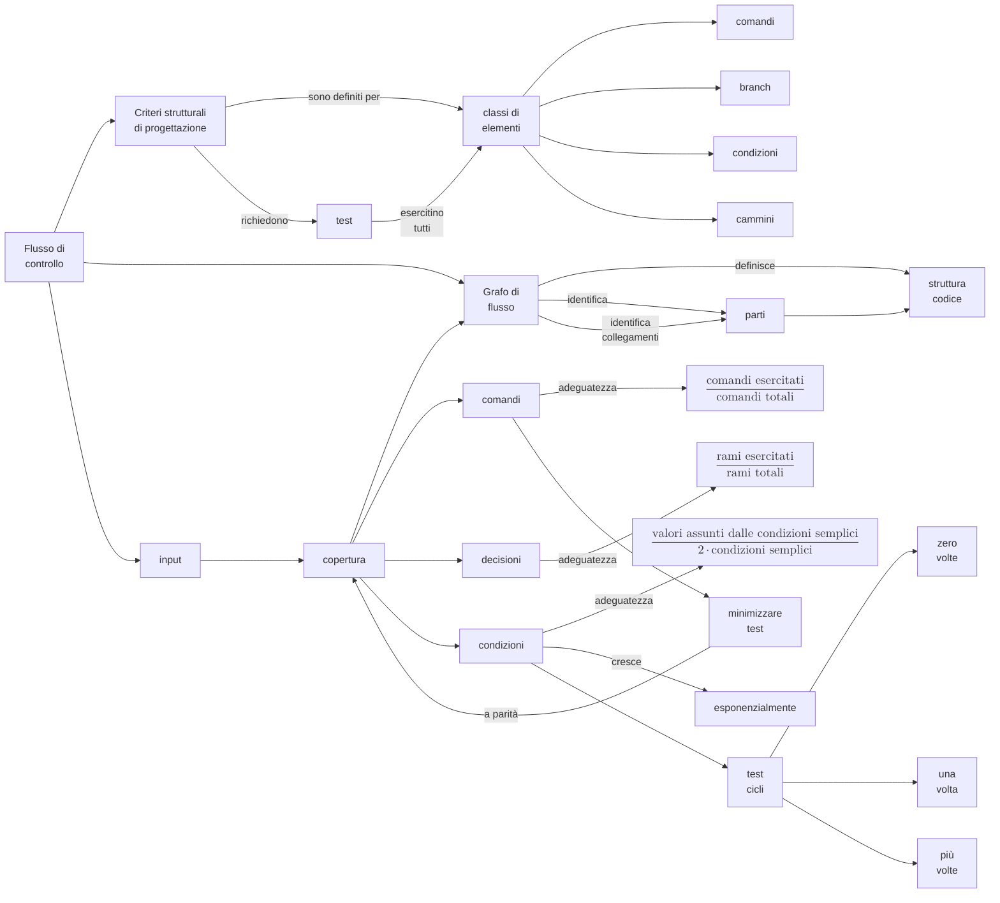
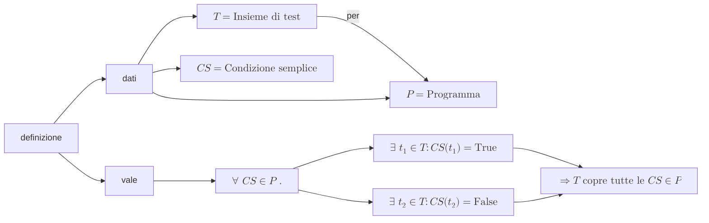
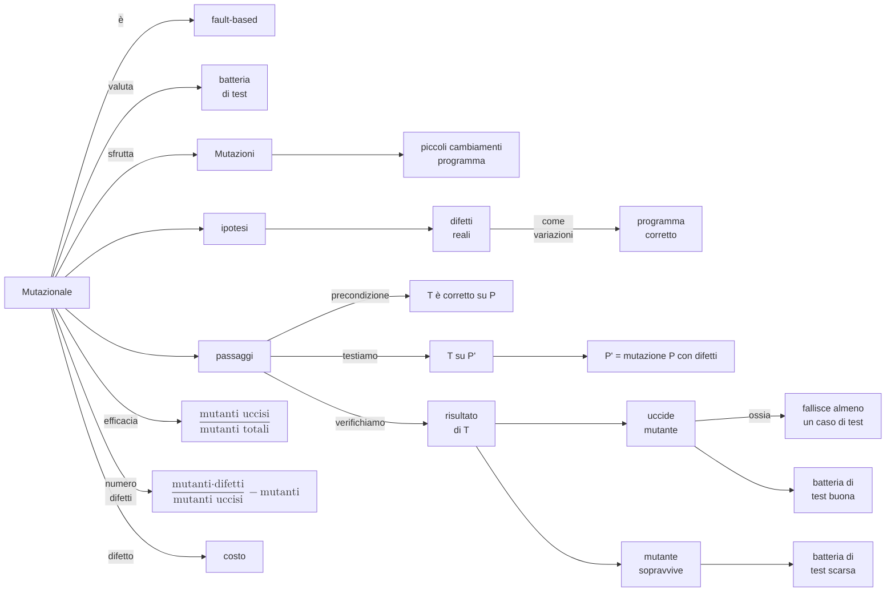
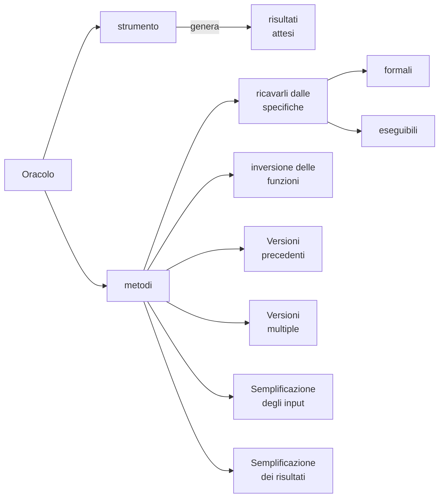
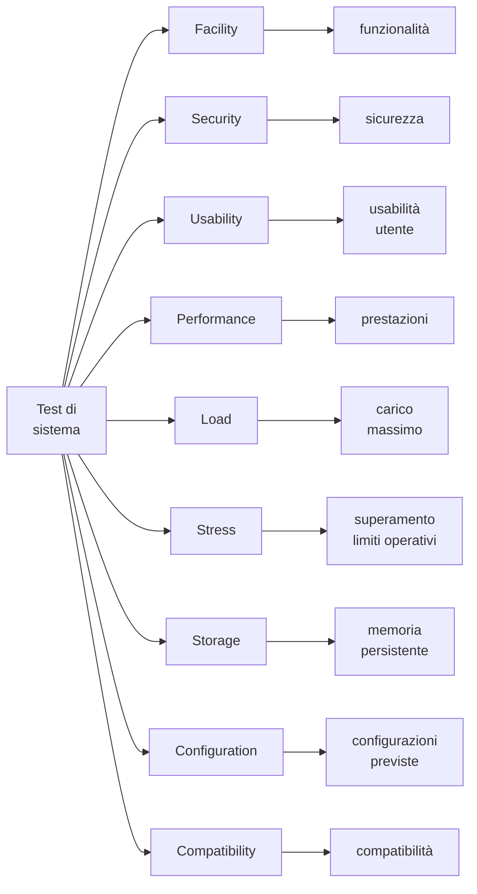

# Metodi Black-box

## Selezione dei valori di test

## Testing combinatorio

# Metodi White-box

## Flusso di controllo

### Copertura delle condizioni definizione formale

## Altri criteri di test

### Mutazionale

### Oracolo

# Test di sistema

