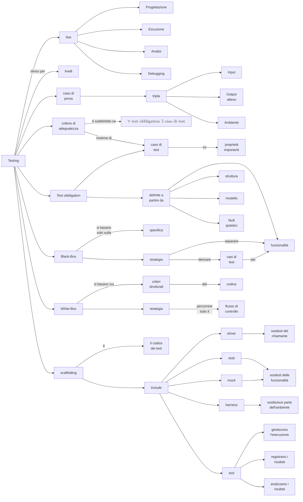
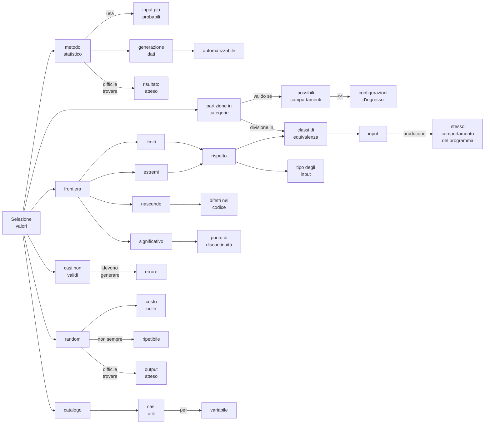
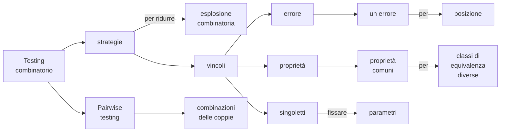

```mermaid
graph LR
Testing --> fasi --> Progettazione & Escuzione & Analisi & Debugging
Testing -- diviso per --> livelli
Testing --> cp["caso di
prova"] --> tripla --> Input & OA["Output
atteso"] & Ambiente
Testing --> ca["criterio di
adeguatezza"] -- "è soddisfatto se" --> for["$$\forall\text{ test obbligation }\\\ \exists\text{ caso di test}$$"]
ca -- insieme di --> ct
Testing --> TO[Test obbligation] --> ct["caso di
test"] -- su --> pi["proprietà
importanti"]
TO --> d["definite a
partire da"] --> funzionalità & struttura & modello & fi["fault
ipotetici"]
Testing --> Black-Box & White-Box
Black-Box -- "si basano
solo sulla" --> specifica
Black-Box --> strategia -- separare --> funzionalità
strategia -- derivare --> ct1["casi di
test"] -- per --> funzionalità
White-Box -- "si basano sui" --> cs["criteri
strutturali"] -- del --> codice
White-Box --> s0[strategia] -- "percorrere
tutto il" --> fc["flusso di
controllo"]
Testing --> scaffolding -- è --> de["il codice
dei test"]
scaffolding --> include --> driver --> sc["sostituti del
chiamante"]
include --> stub & mock --> sf["sostituti delle
funzionalità"]
include --> harness --> sa["sostituisce parte
dell'ambiente"]
include --> tool --> ge["gestiscono
l'esecuzione"] & rr["registrano i
risultati"] & ar["analizzano i
risultati"]
```

# Metodi Black-box

## Selezione dei valori di test

```mermaid
graph LR
    SV["Selezione
    valori"] --> MS["metodo
    statistico"]
    MS -- usa --> IP["input più
    probabili"]
    MS --> GDA["generazione
    dati"] --> automatizzabile
    MS -- "difficile
    trovare" --> ra["risultato
    atteso"]

    PC -- valido se --> pos_com["possibili
    comportamenti"] -- "<<" --> cd["configurazioni
    d'ingresso"]
    SV --> PC["partizione in
    categorie"] -- divisione in --> CE[classi di
    equivalenza]
    CE --> input -- producono --> sc["stesso
    comportamento
    del programma"]

    SV --> frontiera --> limiti & estremi --> rispetto
    rispetto --> CE
    rispetto --> ti["tipo degli
    input"]
    frontiera --> nasconde --> dc["difetti nel
    codice"]
    frontiera --> significativo --> pd["punto di
    discontinuità"]

    SV --> cnv["casi non
    validi"] -- "devono
    generare" --> errore

    SV --> random --> cn["costo
    nullo"]
    random -- non sempre --> ripetibile
    random -- "difficile
    trovare" --> oa["output
    atteso"]
    SV --> catalogo --> cu["casi
    utili"] -- per --> variabile
```

## Testing combinatorio

```mermaid
graph LR
TC["Testing
combinatorio"] --> strategie -- per ridurre --> ec["esplosione
combinatoria"]
strategie --> vincoli --> errore & proprietà & singoletti
errore --> ue["un errore"] -- per --> posizione
proprietà --> pc["proprietà
comuni"] -- per --> cad["classi di
equivalenza
diverse"]
singoletti -- fissare --> parametri
TC --> PT["Pairwise
testing"] --> cc["combinazioni
delle coppie"]
```

# Metodi White-box
