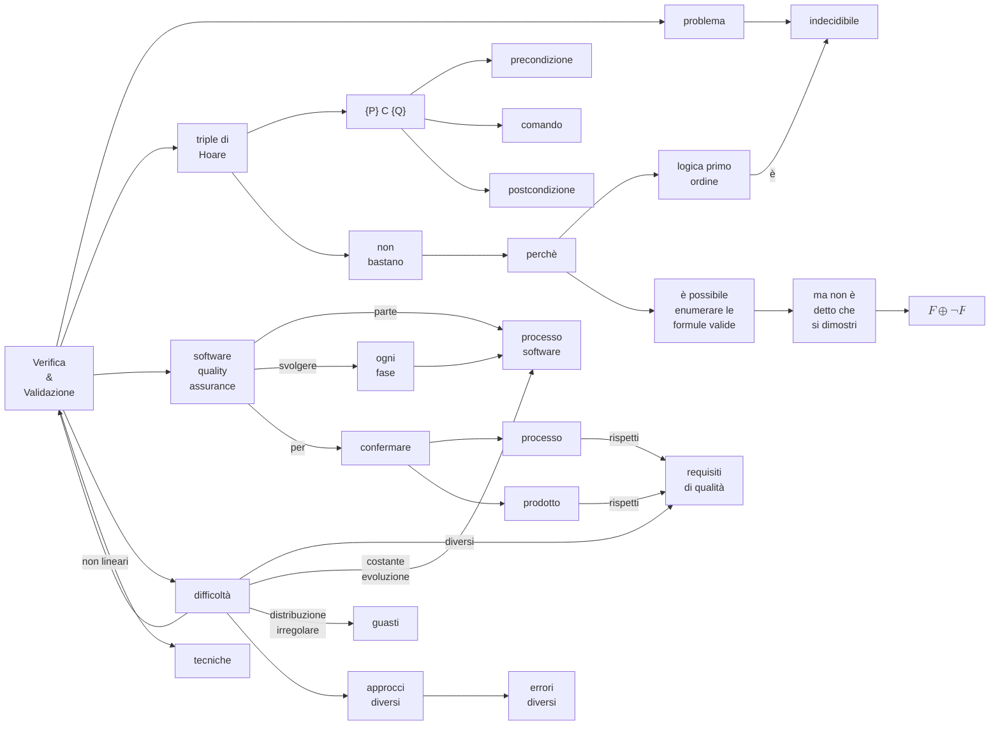
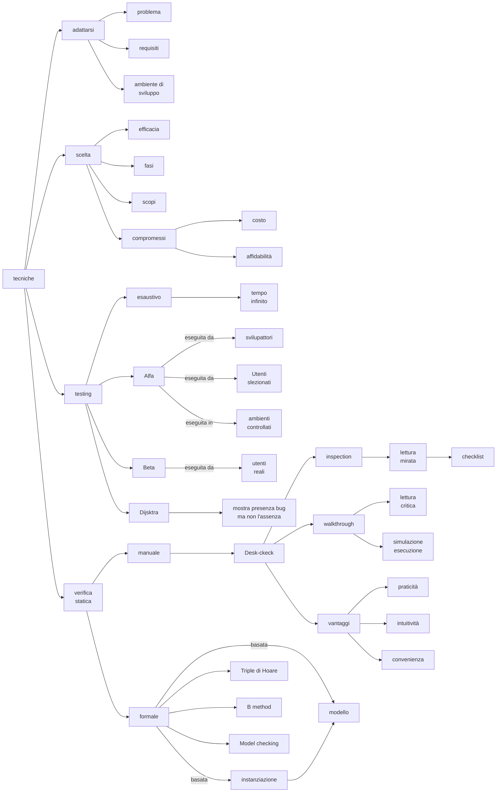

```mermaid
---
config:
    elk: {
        forceNodeModelOrder: false,
    }
---
graph LR
    VV[Verifica
    &
    Validazione] --> problema --> indecidibile
    VV --> TH["triple di
    Hoare"] --> PCQ["{P} C {Q}"]
    PCQ --> precondizione & comando & postcondizione
    TH --> nb["non
    bastano"] --> perchè --> lp["logica primo
    ordine"] -- è --> indecidibile
    perchè --> ef["è possibile
    enumerare le
    formule valide"] --> nd["ma non è
    detto che
    si dimostri"] --> FNF["$$F\oplus\neg{F}$$"]
    VV --> sqa["software
    quality
    assurance"] -- parte --> ps["processo
    software"]
    sqa -- svolgere --> of["ogni
    fase"] --> ps
    sqa -- per --> confermare --> processo & prodotto -- rispetti --> rq["requisiti
    di qualità"]
    VV --> difficoltà -- diversi --> rq
    difficoltà -- "costante
    evoluzione" --> ps
    difficoltà -- "distribuzione
    irregolare" --> guasti
    difficoltà -- non lineari --> VV
    difficoltà --> ad["approcci
    diversi"] --> ed["errori
    diversi"]
    VV --> tecniche
```

# Tecniche

```mermaid
graph LR
    tecniche --> adattarsi --> problema & requisiti & as[ambiente di
    sviluppo]
    tecniche --> scelta --> efficacia
    scelta --> fasi
    scelta --> scopi
    scelta --> compromessi --> costo & affidabilità
    tecniche --> testing --> esaustivo --> ti["tempo
    infinito"]
    testing --> Alfa & Beta
    Alfa -- eseguita da --> svilupattori & US["Utenti
    slezionati"]
    Alfa -- eseguita in --> ac["ambienti
    controllati"]
    Beta -- eseguita da --> ur["utenti
    reali"]
    testing --> Dijsktra --> TD["mostra presenza bug
    ma non l'assenza"]
    tecniche --> VS["verifica
    statica"] --> manuale & formale
    manuale --> Desk-ckeck --> inspection & walkthrough
    inspection --> lm["lettura
    mirata"] --> checklist
    walkthrough --> lc["lettura
    critica"] & se[simulazione
    esecuzione]
    Desk-ckeck --> vantaggi --> praticità & intuitività & convenienza
    formale -- basata --> modello & instanziazione
    instanziazione --> modello
    formale --> TH[Triple di Hoare] & B[B method] & MC[Model checking]
```
