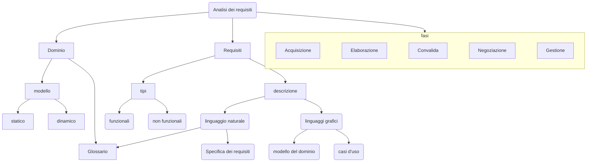
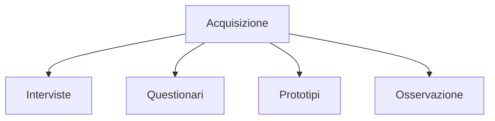
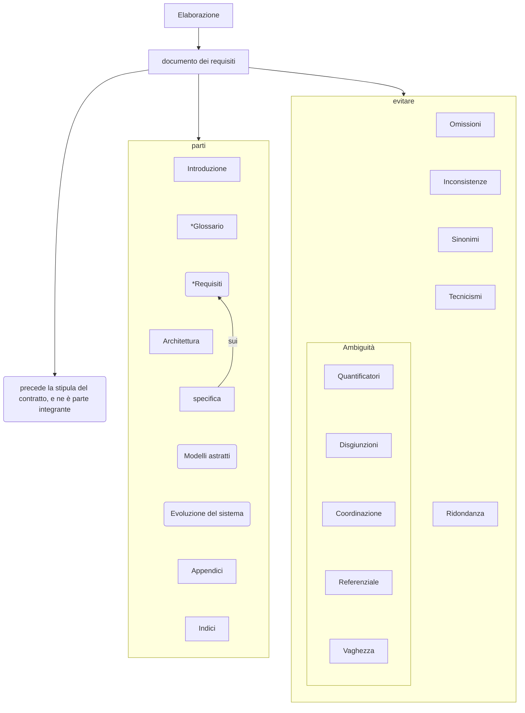
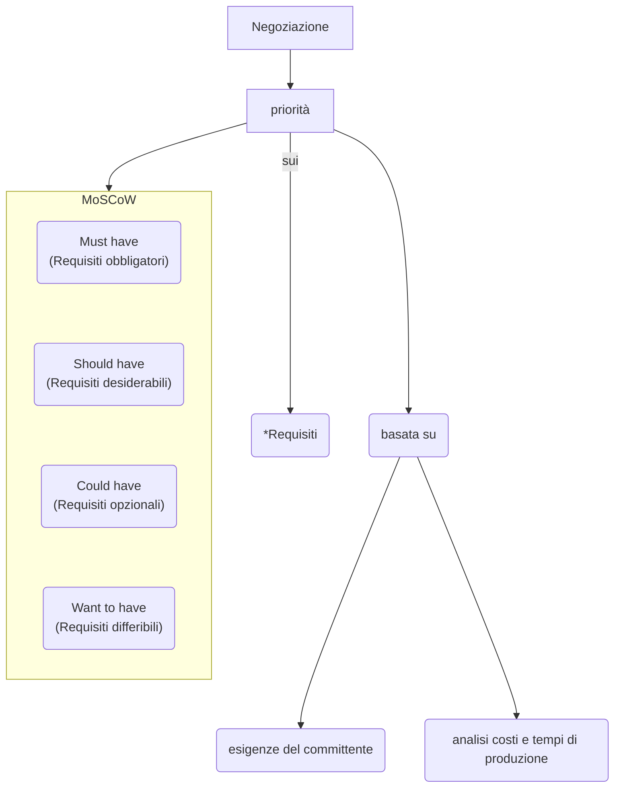
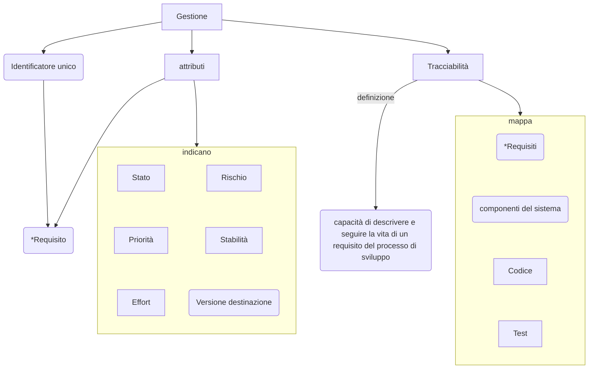

```mermaid
flowchart TB
    AR(Analisi dei requisiti) --> Dominio
    Dominio --> modello
    modello --> statico
    modello --> dinamico
    Dominio --> Glossario

    AR --> Requisiti
    Requisiti --> tipi
    tipi --> fn(funzionali)
    tipi --> nfn(non funzionali)
    Requisiti --> descrizione
    descrizione --> lin_nat(linguaggio naturale)
    lin_nat --> Glossario
    lin_nat --> spec_req(Specifica dei requisiti)
    descrizione --> lin_graf(linguaggi grafici)
    lin_graf --> dominio(modello del dominio)
    lin_graf --> casi_uso(casi d'uso)

    AR --> fasi
    subgraph fasi
        Acquisizione ~~~
        Elaborazione ~~~
        Convalida ~~~
        Negoziazione ~~~
        Gestione
    end
```

# Fasi

## Acquisizione

```mermaid
graph TD
    Acquisizione --> Interviste
    Acquisizione --> Questionari
    Acquisizione --> Prototipi
    Acquisizione --> Osservazione
```

---

## Elaborazione & Convalida

```mermaid
---
config:
    elk: {
        forceNodeModelOrder: false,
    }
---
graph TB

    Elaborazione --> doc_req[documento dei requisiti] --> Contratto(precede la stipula del contratto, e ne è parte integrante)
    doc_req --> parti
    subgraph parti
    direction TB
        Introduzione ~~~
        *Glossario ~~~
        R0(*Requisiti) ~~~
        Architettura ~~~
        specifica -->|sui| R0
        specifica ~~~ mod_ast(Modelli astratti) ~~~
        ev_sis(Evoluzione del sistema) ~~~
        Appendici ~~~
        Indici
    end
    doc_req[documento dei requisiti] --> evitare
    subgraph evitare
    direction TB
        Omissioni ~~~
        Inconsistenze ~~~ Sinonimi
        subgraph Ambiguità
        direction TB
            Quantificatori ~~~
            Disgiunzioni ~~~
            Coordinazione ~~~
            Referenziale ~~~
            Vaghezza
        end
        Sinonimi ~~~
        Tecnicismi ~~~
        Ridondanza
    end
```

---

## Negoziazione

```mermaid
graph TB
    Negoziazione --> priorità -->|sui| R1(*Requisiti)
    priorità --> basata_su(basata su) --> es_com(esigenze del committente)
    priorità --> MoSCoW
    subgraph MoSCoW
    direction TB
        MH("Must have
(Requisiti obbligatori)")
        MH ~~~ SH
        SH("Should have
(Requisiti desiderabili)")
        SH ~~~ CH
        CH("Could have
(Requisiti opzionali)")
        CH ~~~ WH
        WH("Want to have
(Requisiti differibili)")
    end
    basata_su --> tempicosti(analisi costi e tempi di produzione)
```

---

## Gestione

```mermaid
---
config:
    elk: {
        forceNodeModelOrder: false,
    }
---
graph TB
    Gestione --> IU(Identificatore unico) --> R2(*Requisito)
    Gestione --> attributi --> R2 & indicano
    subgraph indicano
    direction TB
        Stato ~~~
        Priorità ~~~
        Effort
        Rischio ~~~
        Stabilità ~~~
        VD(Versione destinazione)
    end
    Tracciabilità -->|definizione| T_Def(capacità di descrivere e seguire la vita di un requisito del processo di sviluppo)
    Gestione --> Tracciabilità --> mappa
    subgraph mappa
    direction TB
        R3(*Requisiti) ~~~
        comp_sis(componenti del sistema) ~~~
        Codice ~~~
        Test
    end
```
