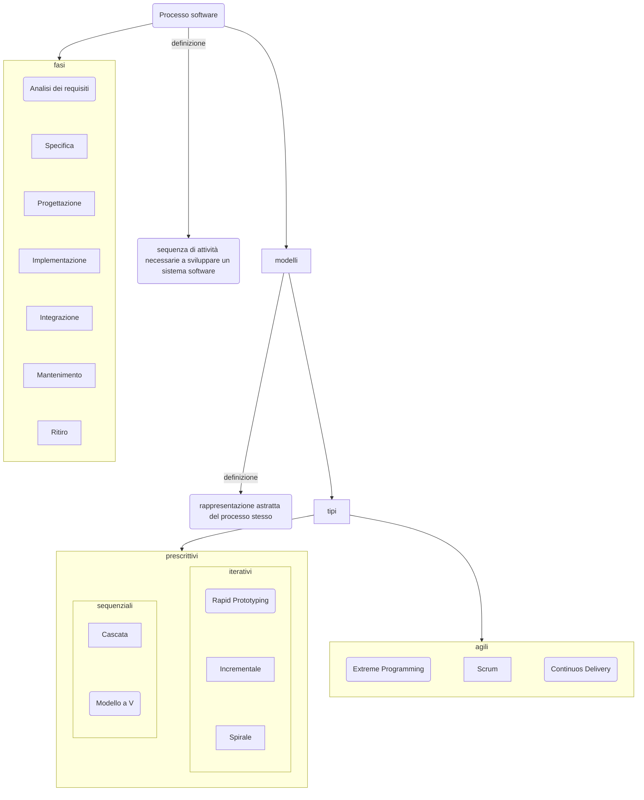

```mermaid
flowchart TD
    PS(Processo software) -->|definizione| def_PS(sequenza di attività necessarie a sviluppare un sistema software)
    PS --> fasi
    subgraph fasi
        direction TB
        AR(Analisi dei requisiti) ~~~
        Specifica ~~~
        Progettazione ~~~
        Implementazione ~~~
        Integrazione ~~~
        Mantenimento ~~~
        Ritiro
    end
    PS --> modelli -->|definizione| def_mod(rappresentazione astratta del processo stesso)
    modelli --> tipi --> prescrittivi
    subgraph prescrittivi
    direction LR
        subgraph sequenziali
            direction TB
            Cascata ~~~
            ModV(Modello a V)
        end
        sequenziali ~~~ iterativi
        subgraph iterativi
        direction TB
            RP(Rapid Prototyping) ~~~
            Incrementale ~~~
            Spirale
        end
    end
    tipi --> agili
    subgraph agili
        EP(Extreme Programming) ~~~
        Scrum ~~~
        CD(Continuos Delivery)
    end
```
